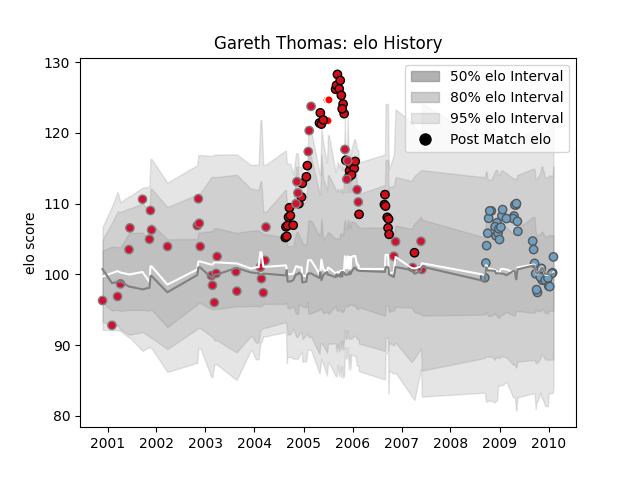

---  
layout: page  
title: Gareth Thomas  
date: 2022-12-18 16:12:46.714106  
categories: player  
---
# Gareth Thomas

## Positions: W, C

## Country: Wales

## Current elo: 102.0

## Current Percentile: 50.0

# Elo History

# Match History

| Team                    |   Appearances |   Win Rate |
|:------------------------|--------------:|-----------:|
| Wales                   |            43 |   0.453488 |
| Stade Toulousain        |            42 |   0.738095 |
| Cardiff Blues           |            41 |   0.597561 |
| Celtic Warriors         |             6 |   0.666667 |
| British and Irish Lions |             3 |   0        |

| Opponent             |   Matches |   Win Rate |
|:---------------------|----------:|-----------:|
| England              |         8 |   0.25     |
| New Zealand          |         6 |   0        |
| Australia            |         5 |   0.3      |
| Edinburgh            |         5 |   0.4      |
| Biarritz Olympique   |         5 |   1        |
| Perpignan            |         5 |   0.6      |
| Wasps                |         4 |   0.625    |
| Calvisano            |         4 |   1        |
| Gloucester Rugby     |         4 |   1        |
| Italy                |         4 |   0.75     |
| Castres Olympique    |         4 |   1        |
| France               |         4 |   0.5      |
| Scarlets             |         4 |   0.5      |
| Glasgow Warriors     |         3 |   0.333333 |
| Romania              |         3 |   1        |
| Narbonne             |         3 |   0.666667 |
| Montpellier Herault  |         3 |   0.833333 |
| Scotland             |         3 |   0.666667 |
| South Africa         |         3 |   0        |
| Stade Francais Paris |         3 |   0        |
| Pau                  |         3 |   0.666667 |
| Ireland              |         3 |   0        |
| Connacht             |         3 |   0.666667 |
| Dragons              |         3 |   1        |
| Canada               |         2 |   1        |
| Ulster               |         2 |   1        |
| Stade Toulousain     |         2 |   0.5      |
| Auch                 |         2 |   1        |
| Beziers              |         2 |   0.5      |
| Ospreys              |         2 |   0        |
| Clermont Auvergne    |         2 |   0        |
| Munster              |         2 |   0        |
| Agen                 |         2 |   1        |
| Llanelli             |         2 |   1        |
| Harlequins           |         2 |   1        |
| Leinster             |         2 |   0        |
| Japan                |         2 |   1        |
| Montauban            |         1 |   1        |
| Bayonne              |         1 |   1        |
| Tonga                |         1 |   1        |
| Albi                 |         1 |   1        |
| Argentina            |         1 |   0        |
| Bath Rugby           |         1 |   1        |
| Sale Sharks          |         1 |   1        |
| London Irish         |         1 |   0        |
| Leicester Tigers     |         1 |   0.5      |
| Bourgoin-Jallieu     |         1 |   1        |
| Brive                |         1 |   0        |
| Newcastle Falcons    |         1 |   1        |
| Grenoble             |         1 |   1        |
| Fiji                 |         1 |   1        |