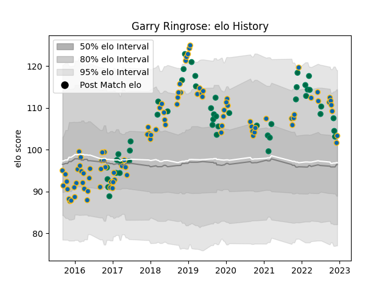

---  
layout: page  
title: Garry Ringrose  
date: 2023-02-02 19:07:22.087926  
categories: player  
---
# Garry Ringrose

## Positions: C

## Country: Ireland

## Current elo: 88.0

## Current Percentile: 28.0

# Elo History

# Match History

| Team     |   Appearances |   Win Rate |
|:---------|--------------:|-----------:|
| Leinster |            99 |   0.813131 |
| Ireland  |            48 |   0.75     |

| Opponent                 |   Matches |   Win Rate |
|:-------------------------|----------:|-----------:|
| Munster                  |        12 |   0.916667 |
| Ulster                   |        10 |   0.8      |
| Connacht                 |         8 |   0.75     |
| New Zealand              |         7 |   0.571429 |
| Benetton Treviso         |         7 |   1        |
| Scarlets                 |         6 |   0.666667 |
| Wales                    |         6 |   0.5      |
| Italy                    |         6 |   1        |
| Glasgow Warriors         |         6 |   0.666667 |
| Scotland                 |         6 |   0.833333 |
| England                  |         5 |   0.6      |
| Dragons                  |         5 |   0.8      |
| Japan                    |         4 |   0.75     |
| France                   |         4 |   0.5      |
| Northampton Saints       |         4 |   1        |
| Wasps                    |         4 |   0.75     |
| Edinburgh                |         3 |   0.666667 |
| Saracens                 |         3 |   0.333333 |
| Stade Toulousain         |         3 |   0.666667 |
| Australia                |         3 |   1        |
| Racing 92                |         3 |   1        |
| Bath Rugby               |         3 |   1        |
| Zebre                    |         3 |   1        |
| Ospreys                  |         2 |   1        |
| United States of America |         2 |   1        |
| Lyon                     |         2 |   1        |
| Montpellier Herault      |         2 |   0.5      |
| Gloucester Rugby         |         2 |   1        |
| Exeter Chiefs            |         2 |   1        |
| Castres Olympique        |         2 |   0.75     |
| Cardiff Blues            |         2 |   1        |
| Bulls                    |         2 |   0.5      |
| Russia                   |         1 |   1        |
| Fiji                     |         1 |   1        |
| Sharks                   |         1 |   1        |
| South Africa             |         1 |   1        |
| Southern Kings           |         1 |   1        |
| Clermont Auvergne        |         1 |   0        |
| Canada                   |         1 |   1        |
| Argentina                |         1 |   1        |