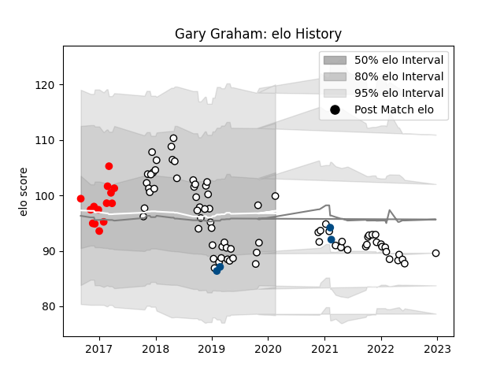

---  
layout: page  
title: Gary Graham  
date: 2022-12-31 16:29:23.047511  
categories: player  
---
# Gary Graham

## Positions: FL

## Country: Scotland

## Current elo: 100.0

## Current Percentile: 21.0

# Elo History

# Match History

| Team              |   Appearances |   Win Rate |
|:------------------|--------------:|-----------:|
| Newcastle Falcons |            76 |   0.453947 |
| Jersey            |            14 |   0.642857 |
| Scotland          |             4 |   0.5      |

| Opponent            |   Matches |   Win Rate |
|:--------------------|----------:|-----------:|
| Bath Rugby          |         7 |   0.428571 |
| Wasps               |         7 |   0.571429 |
| Gloucester Rugby    |         7 |   0.142857 |
| London Irish        |         6 |   0.333333 |
| Sale Sharks         |         6 |   0.666667 |
| Leicester Tigers    |         5 |   0.2      |
| Exeter Chiefs       |         5 |   0.4      |
| Bristol Rugby       |         5 |   0.2      |
| Northampton Saints  |         5 |   0.4      |
| Cornish Pirates     |         4 |   1        |
| Harlequins          |         3 |   0.333333 |
| Saracens            |         3 |   0        |
| Worcester Warriors  |         3 |   0.833333 |
| Dragons             |         2 |   1        |
| Doncaster           |         2 |   0.5      |
| Edinburgh           |         2 |   0        |
| Toulon              |         2 |   0.5      |
| Rotherham Titans    |         2 |   0.5      |
| Bordeaux Begles     |         2 |   1        |
| London Scottish     |         2 |   1        |
| Montpellier Herault |         2 |   0.5      |
| Wales               |         1 |   0        |
| Richmond            |         1 |   1        |
| Italy               |         1 |   1        |
| Nottingham          |         1 |   1        |
| Jersey              |         1 |   1        |
| Bedford             |         1 |   0        |
| Hartpury College    |         1 |   1        |
| France              |         1 |   0        |
| England             |         1 |   1        |
| Ealing Trailfinders |         1 |   0        |
| Cardiff Blues       |         1 |   1        |
| Yorkshire Carnegie  |         1 |   1        |