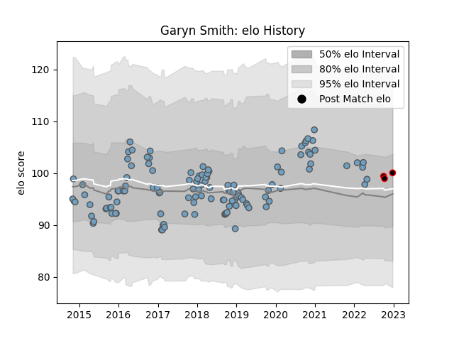

---  
layout: page  
title: Garyn Smith  
date: 2022-12-28 12:57:00.406551  
categories: player  
---
# Garyn Smith

## Positions: C

## Current elo: 100.0

## Current Percentile: 58.0

# Elo History

# Match History

| Team            |   Appearances |   Win Rate |
|:----------------|--------------:|-----------:|
| Cardiff Blues   |           120 |   0.525    |
| Cornish Pirates |             3 |   0.333333 |

| Opponent            |   Matches |   Win Rate |
|:--------------------|----------:|-----------:|
| Ospreys             |        10 |   0.1      |
| Munster             |        10 |   0.3      |
| Zebre               |         9 |   0.777778 |
| Benetton Treviso    |         9 |   0.666667 |
| Connacht            |         8 |   0.5      |
| Dragons             |         8 |   1        |
| Scarlets            |         7 |   0.571429 |
| Edinburgh           |         7 |   0.428571 |
| Glasgow Warriors    |         7 |   0.142857 |
| Ulster              |         6 |   0.333333 |
| Leinster            |         5 |   0.2      |
| Lyon                |         4 |   1        |
| Cheetahs            |         4 |   0.5      |
| Sale Sharks         |         3 |   0.333333 |
| Southern Kings      |         3 |   1        |
| Pau                 |         3 |   1        |
| Montpellier Herault |         2 |   0.5      |
| Bristol Rugby       |         2 |   1        |
| Newcastle Falcons   |         2 |   1        |
| Saracens            |         2 |   0        |
| Stade Toulousain    |         2 |   1        |
| Worcester Warriors  |         1 |   0        |
| Wasps               |         1 |   1        |
| Stormers            |         1 |   0        |
| Jersey              |         1 |   0        |
| Calvisano           |         1 |   1        |
| Hartpury College    |         1 |   0        |
| Exeter Chiefs       |         1 |   0        |
| Gloucester Rugby    |         1 |   1        |
| London Irish        |         1 |   0        |
| Ampthill            |         1 |   1        |