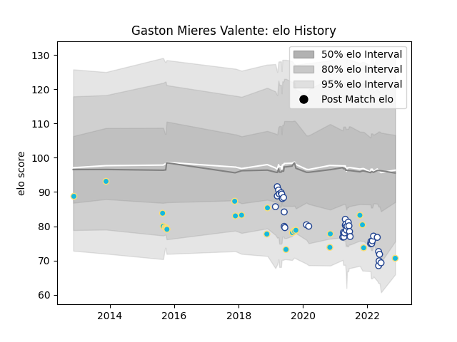

---  
layout: page  
title: Gaston Mieres Valente  
date: 2022-11-16 11:28:18.072734  
categories: player  
---
# Gaston Mieres Valente

## Positions: FB, W

## Country: Uruguay

## Current elo: 91.0

## Current Percentile: 21.0

# Elo History

# Match History

| Team           |   Appearances |   Win Rate |
|:---------------|--------------:|-----------:|
| Uruguay        |            23 |   0.391304 |
| Toronto Arrows |            21 |   0.571429 |

| Opponent                 |   Matches |   Win Rate |
|:-------------------------|----------:|-----------:|
| Spain                    |         4 |   0.5      |
| Fiji                     |         3 |   0.333333 |
| Romania                  |         3 |   0.666667 |
| R.U. New York            |         3 |   0.333333 |
| NOLA Gold                |         2 |   0.5      |
| Namibia                  |         2 |   1        |
| Utah Warriors            |         2 |   1        |
| Seattle Seawolves        |         2 |   1        |
| San Diego Legion         |         2 |   0.5      |
| Old Glory DC             |         2 |   0.5      |
| New England Free Jacks   |         2 |   0.5      |
| Wales                    |         2 |   0        |
| L. A. Giltinis           |         2 |   0        |
| Japan                    |         2 |   0        |
| Australia                |         1 |   0        |
| Italy                    |         1 |   0        |
| Portugal                 |         1 |   0        |
| Glendale Raptors         |         1 |   1        |
| Georgia                  |         1 |   0        |
| England                  |         1 |   0        |
| Dallas Jackals           |         1 |   1        |
| Colorado Raptors         |         1 |   0        |
| United States of America |         1 |   1        |
| Brazil                   |         1 |   1        |
| Austin Herd              |         1 |   1        |