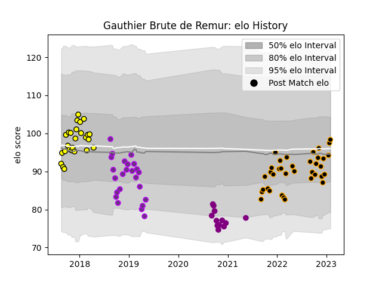

---  
layout: page  
title: Gauthier Brute de Remur  
date: 2022-12-18 16:30:12.582528  
categories: player  
---
# Gauthier Brute de Remur

## Positions: H

## Current elo: 88.0

## Current Percentile: 17.0

# Elo History

# Match History

| Team             |   Appearances |   Win Rate |
|:-----------------|--------------:|-----------:|
| Chambery         |            23 |   0.565217 |
| Carcassonne      |            13 |   0.384615 |
| US Bressane      |            11 |   0.363636 |
| Soyaux-Angouleme |             1 |   0        |

| Opponent                   |   Matches |   Win Rate |
|:---------------------------|----------:|-----------:|
| Dax                        |         4 |   0.5      |
| Cognac Saint Jean d'Angély |         3 |   0.666667 |
| Soyaux-Angouleme           |         3 |   1        |
| Beziers                    |         3 |   0.333333 |
| Colomiers                  |         3 |   0.666667 |
| Aurillac                   |         2 |   0.5      |
| Bayonne                    |         2 |   0.5      |
| Biarritz Olympique         |         2 |   0.5      |
| Valence Romans Drome Rugby |         2 |   0.5      |
| Bourgoin-Jallieu           |         2 |   0.5      |
| Narbonne                   |         2 |   0.5      |
| Montauban                  |         2 |   0.5      |
| Tarbes                     |         2 |   1        |
| Rennes                     |         1 |   1        |
| Albi                       |         1 |   0        |
| Suresnes                   |         1 |   0        |
| Oyonnax                    |         1 |   0        |
| US Bressane                |         1 |   0        |
| Provence Rugby             |         1 |   0        |
| Massy                      |         1 |   0        |
| Nice                       |         1 |   1        |
| Nevers                     |         1 |   0        |
| Mont-de-Marsan             |         1 |   0        |
| Aubenas                    |         1 |   0        |
| Grenoble                   |         1 |   0        |
| Dijon                      |         1 |   1        |
| Carcassonne                |         1 |   0        |
| Blagnac                    |         1 |   0        |
| Vannes                     |         1 |   0        |