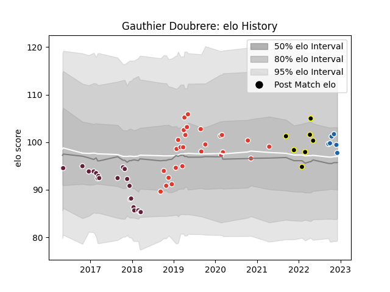

---  
layout: page  
title: Gauthier Doubrere  
date: 2022-12-18 16:14:18.790548  
categories: player  
---
# Gauthier Doubrere

## Positions: SH

## Current elo: 95.0

## Current Percentile: 57.0

# Elo History

# Match History

| Team               |   Appearances |   Win Rate |
|:-------------------|--------------:|-----------:|
| Biarritz Olympique |            26 |   0.480769 |
| Bordeaux Begles    |            21 |   0.5      |
| Castres Olympique  |             7 |   0.285714 |
| Mont-de-Marsan     |             7 |   0.857143 |

| Opponent             |   Matches |   Win Rate |
|:---------------------|----------:|-----------:|
| Vannes               |         6 |   0.333333 |
| Aurillac             |         4 |   0.75     |
| Grenoble             |         4 |   0.875    |
| Carcassonne          |         4 |   0.75     |
| Clermont Auvergne    |         3 |   0.5      |
| Mont-de-Marsan       |         3 |   0.333333 |
| Agen                 |         3 |   1        |
| Bayonne              |         3 |   0.666667 |
| Massy                |         2 |   0.5      |
| Dragons              |         2 |   0.5      |
| Exeter Chiefs        |         2 |   0        |
| US Bressane          |         2 |   0.5      |
| La Rochelle          |         2 |   0.5      |
| Stade Francais Paris |         2 |   0.5      |
| Beziers              |         2 |   1        |
| RC Enisei            |         2 |   1        |
| Nevers               |         2 |   0        |
| Perpignan            |         2 |   0        |
| Oyonnax              |         2 |   0.5      |
| Pau                  |         1 |   1        |
| Racing 92            |         1 |   0        |
| Castres Olympique    |         1 |   0        |
| Newcastle Falcons    |         1 |   0        |
| Colomiers            |         1 |   0        |
| Montauban            |         1 |   1        |
| Lyon                 |         1 |   0        |
| Bordeaux Begles      |         1 |   0        |
| Montpellier Herault  |         1 |   0        |