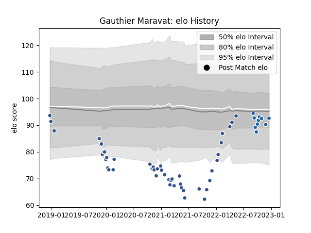

---  
layout: page  
title: Gauthier Maravat  
date: 2023-01-06 00:20:20.757065  
categories: player  
---
# Gauthier Maravat

## Positions: L, FL

## Current elo: 96.0

## Current Percentile: 26.0

# Elo History

# Match History

| Team              |   Appearances |   Win Rate |
|:------------------|--------------:|-----------:|
| Agen              |            56 |   0.151786 |
| Castres Olympique |            12 |   0.458333 |

| Opponent             |   Matches |   Win Rate |
|:---------------------|----------:|-----------:|
| Bayonne              |         4 |   0.375    |
| Bordeaux Begles      |         4 |   0        |
| Brive                |         4 |   0.5      |
| Stade Toulousain     |         4 |   0        |
| La Rochelle          |         4 |   0        |
| Lyon                 |         4 |   0        |
| Racing 92            |         4 |   0.125    |
| Clermont Auvergne    |         3 |   0.333333 |
| Edinburgh            |         3 |   0        |
| Stade Francais Paris |         3 |   0.333333 |
| Montpellier Herault  |         3 |   0.333333 |
| Narbonne             |         2 |   0.5      |
| Vannes               |         2 |   0.5      |
| Toulon               |         2 |   0        |
| Rouen                |         2 |   0.5      |
| Oyonnax              |         2 |   0        |
| Montauban            |         2 |   0.5      |
| Beziers              |         2 |   0        |
| Grenoble             |         2 |   0.5      |
| Colomiers            |         2 |   0.5      |
| Wasps                |         2 |   0        |
| Nevers               |         1 |   1        |
| Pau                  |         1 |   0        |
| Perpignan            |         1 |   0        |
| Mont-de-Marsan       |         1 |   0        |
| Harlequins           |         1 |   0        |
| Castres Olympique    |         1 |   0        |
| US Bressane          |         1 |   0        |
| Carcassonne          |         1 |   0        |