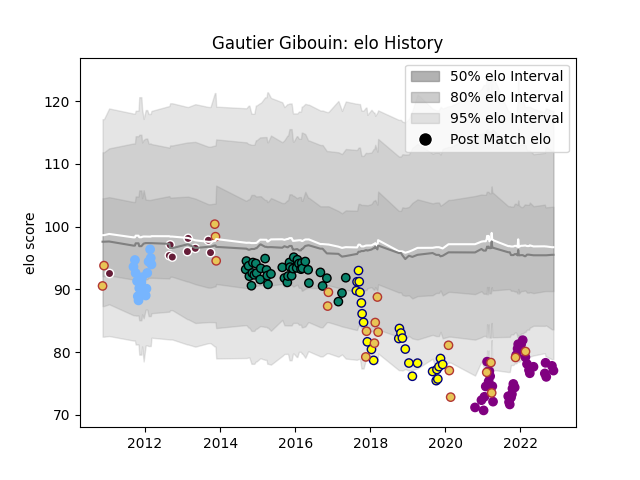

---  
layout: page  
title: Gautier Gibouin  
date: 2023-03-21 17:58:21.650590  
categories: player  
---
# Gautier Gibouin

Last updated: 2023-03-21
## Positions: FL

## Country: Spain

## Current elo: 84.0

## Current Percentile: 13.0

# Elo History

# Match History

| Team             |   Appearances |   Win Rate |
|:-----------------|--------------:|-----------:|
| Soyaux-Angouleme |            55 |   0.5      |
| Montauban        |            54 |   0.453704 |
| Nevers           |            45 |   0.533333 |
| Spain            |            42 |   0.511905 |
| Bordeaux Begles  |            22 |   0.318182 |
| Périgueux        |            19 |   0.210526 |

| Opponent                   |   Matches |   Win Rate |
|:---------------------------|----------:|-----------:|
| Beziers                    |        11 |   0.363636 |
| Carcassonne                |        11 |   0.363636 |
| Grenoble                   |        10 |   0.3      |
| Aurillac                   |        10 |   0.4      |
| Oyonnax                    |        10 |   0.3      |
| Massy                      |         9 |   0.666667 |
| Colomiers                  |         9 |   0.333333 |
| Russia                     |         8 |   0.75     |
| Mont-de-Marsan             |         8 |   0.5      |
| Romania                    |         7 |   0.142857 |
| Biarritz Olympique         |         7 |   0.428571 |
| Albi                       |         7 |   0.714286 |
| Tarbes                     |         7 |   0.5      |
| Bourgoin-Jallieu           |         7 |   0.571429 |
| Perpignan                  |         6 |   0.666667 |
| Narbonne                   |         6 |   0.5      |
| Provence Rugby             |         5 |   0.4      |
| Dax                        |         5 |   0.6      |
| Portugal                   |         5 |   0.6      |
| Soyaux-Angouleme           |         5 |   0.6      |
| Georgia                    |         5 |   0.2      |
| Vannes                     |         5 |   0.6      |
| Bayonne                    |         5 |   0.4      |
| Montauban                  |         4 |   0.75     |
| Germany                    |         4 |   0.875    |
| Valence Romans Drome Rugby |         4 |   0.625    |
| Pau                        |         4 |   0        |
| Agen                       |         3 |   0.333333 |
| Belgium                    |         3 |   0.666667 |
| Nevers                     |         3 |   0        |
| La Rochelle                |         3 |   0.333333 |
| Lyon                       |         3 |   0.333333 |
| Chambery                   |         2 |   0        |
| Cognac Saint Jean d'Angély |         2 |   1        |
| Clermont Auvergne          |         2 |   0        |
| Suresnes                   |         2 |   1        |
| Rouen                      |         2 |   0.5      |
| Racing 92                  |         2 |   0        |
| Blagnac                    |         2 |   1        |
| Aubenas                    |         2 |   1        |
| Uruguay                    |         2 |   0.5      |
| Canada                     |         2 |   0        |
| Nice                       |         2 |   0.5      |
| Montpellier Herault        |         2 |   0        |
| Stade Francais Paris       |         1 |   0        |
| Tonga                      |         1 |   0        |
| Ukraine                    |         1 |   1        |
| Stade Toulousain           |         1 |   0        |
| Dijon                      |         1 |   0        |
| Auch                       |         1 |   0        |
| Saint-Etienne              |         1 |   1        |
| Roval Drome XV             |         1 |   1        |
| Brive                      |         1 |   0        |
| Castres Olympique          |         1 |   0        |
| Namibia                    |         1 |   1        |
| Chile                      |         1 |   1        |
| Japan                      |         1 |   0        |
| Brazil                     |         1 |   1        |