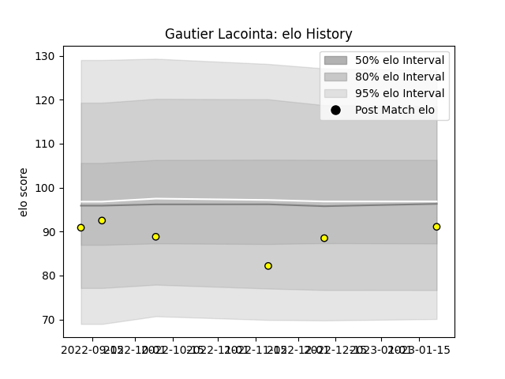

---  
layout: page  
title: Gautier Lacointa  
date: 2022-12-18 16:31:29.824545  
categories: player  
---
# Gautier Lacointa

## Positions: W

## Current elo: 91.0

## Current Percentile: 18.0

# Elo History

# Match History

| Team   |   Appearances |   Win Rate |
|:-------|--------------:|-----------:|
| Albi   |             5 |        0.5 |

| Opponent                   |   Matches |   Win Rate |
|:---------------------------|----------:|-----------:|
| Carqueiranne-Hyères        |         1 |        0   |
| Cognac Saint Jean d'Angély |         1 |        1   |
| Nice                       |         1 |        0.5 |
| Rennes                     |         1 |        1   |
| Tarbes                     |         1 |        0   |