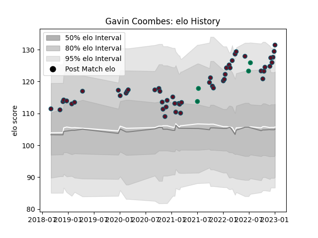

---  
layout: page  
title: Gavin Coombes  
date: 2022-12-09 13:20:31.556648  
categories: player  
---
# Gavin Coombes

## Positions: N8, FL

## Country: Ireland

## Current elo: 113.0

## Current Percentile: 86.0

# Elo History

# Match History

| Team    |   Appearances |   Win Rate |
|:--------|--------------:|-----------:|
| Munster |            48 |       0.75 |
| Ireland |             4 |       0.75 |

| Opponent                 |   Matches |   Win Rate |
|:-------------------------|----------:|-----------:|
| Connacht                 |         7 |   0.714286 |
| Edinburgh                |         5 |   1        |
| Leinster                 |         4 |   0        |
| Dragons                  |         4 |   0.75     |
| Ulster                   |         4 |   0.25     |
| Scarlets                 |         3 |   1        |
| Benetton Treviso         |         3 |   1        |
| Zebre                    |         3 |   1        |
| Cheetahs                 |         2 |   1        |
| Glasgow Warriors         |         2 |   0.5      |
| New Zealand Maori        |         2 |   0.5      |
| Ospreys                  |         2 |   0.5      |
| Southern Kings           |         2 |   1        |
| Cardiff Blues            |         2 |   1        |
| Japan                    |         1 |   1        |
| Bulls                    |         1 |   1        |
| Castres Olympique        |         1 |   1        |
| Sharks                   |         1 |   1        |
| Stormers                 |         1 |   1        |
| United States of America |         1 |   1        |
| Wasps                    |         1 |   1        |