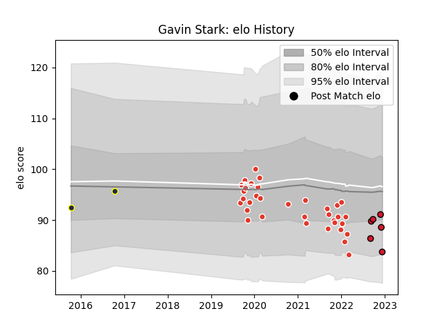

---  
layout: page  
title: Gavin Stark  
date: 2022-12-14 11:30:27.295511  
categories: player  
---
# Gavin Stark

## Positions: W

## Current elo: 84.0

## Current Percentile: 19.0

# Elo History

# Match History

| Team               |   Appearances |   Win Rate |
|:-------------------|--------------:|-----------:|
| Biarritz Olympique |            34 |   0.470588 |
| Oyonnax            |             6 |   1        |
| Otago              |             2 |   1        |

| Opponent                   |   Matches |   Win Rate |
|:---------------------------|----------:|-----------:|
| Perpignan                  |         4 |   0        |
| Carcassonne                |         3 |   0.666667 |
| Soyaux-Angouleme           |         3 |   0.666667 |
| Montauban                  |         3 |   0.666667 |
| Nevers                     |         3 |   0.333333 |
| Bordeaux Begles            |         2 |   0.5      |
| Toulon                     |         2 |   0        |
| Stade Francais Paris       |         2 |   0.5      |
| Grenoble                   |         2 |   1        |
| Oyonnax                    |         2 |   0.5      |
| Aurillac                   |         1 |   1        |
| Pau                        |         1 |   0        |
| Valence Romans Drome Rugby |         1 |   1        |
| Roval Drome XV             |         1 |   1        |
| Racing 92                  |         1 |   1        |
| Provence Rugby             |         1 |   1        |
| Montpellier Herault        |         1 |   0        |
| Bay of Plenty              |         1 |   1        |
| Mont-de-Marsan             |         1 |   1        |
| Massy                      |         1 |   1        |
| Manawatu                   |         1 |   1        |
| La Rochelle                |         1 |   1        |
| Clermont Auvergne          |         1 |   0        |
| Brive                      |         1 |   0        |
| Beziers                    |         1 |   1        |
| Vannes                     |         1 |   1        |