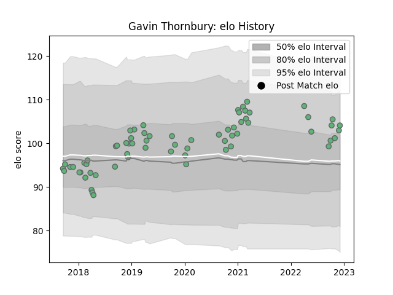

---  
layout: page  
title: Gavin Thornbury  
date: 2022-12-12 15:13:07.844681  
categories: player  
---
# Gavin Thornbury

## Positions: L

## Current elo: 104.0

## Current Percentile: 76.0

# Elo History

# Match History

| Team     |   Appearances |   Win Rate |
|:---------|--------------:|-----------:|
| Connacht |            66 |   0.492424 |

| Opponent            |   Matches |   Win Rate |
|:--------------------|----------:|-----------:|
| Benetton Treviso    |         7 |   1        |
| Cardiff Blues       |         6 |   0.5      |
| Munster             |         6 |   0.166667 |
| Zebre               |         5 |   0.8      |
| Leinster            |         5 |   0.4      |
| Ulster              |         5 |   0.4      |
| Scarlets            |         5 |   0.2      |
| Cheetahs            |         4 |   0.75     |
| Ospreys             |         4 |   0.5      |
| Edinburgh           |         4 |   0.25     |
| Glasgow Warriors    |         2 |   0.5      |
| Perpignan           |         2 |   1        |
| Dragons             |         2 |   0.5      |
| Gloucester Rugby    |         1 |   0        |
| Montpellier Herault |         1 |   0        |
| Bordeaux Begles     |         1 |   1        |
| Sale Sharks         |         1 |   0        |
| Sharks              |         1 |   0        |
| Southern Kings      |         1 |   1        |
| Stade Toulousain    |         1 |   0        |
| Worcester Warriors  |         1 |   0.5      |
| Bulls               |         1 |   0        |