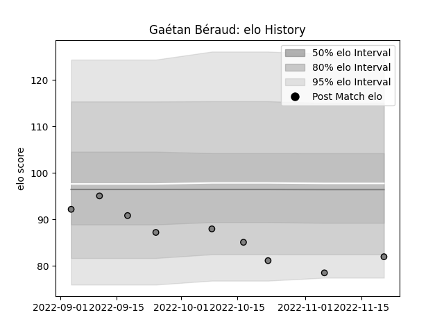

---  
layout: page  
title: Gaétan Béraud  
date: 2022-12-14 11:21:43.207975  
categories: player  
---
# Gaétan Béraud

## Positions: N8

## Current elo: 79.0

## Current Percentile: 7.0

# Elo History

# Match History

| Team   |   Appearances |   Win Rate |
|:-------|--------------:|-----------:|
| Rennes |            11 |   0.181818 |

| Opponent                   |   Matches |   Win Rate |
|:---------------------------|----------:|-----------:|
| Albi                       |         1 |          0 |
| Carqueiranne-Hyères        |         1 |          1 |
| Chambery                   |         1 |          0 |
| Cognac Saint Jean d'Angély |         1 |          1 |
| Dax                        |         1 |          0 |
| Narbonne                   |         1 |          0 |
| Nice                       |         1 |          0 |
| Suresnes                   |         1 |          0 |
| Tarbes                     |         1 |          0 |
| US Bressane                |         1 |          0 |
| Valence Romans Drome Rugby |         1 |          0 |