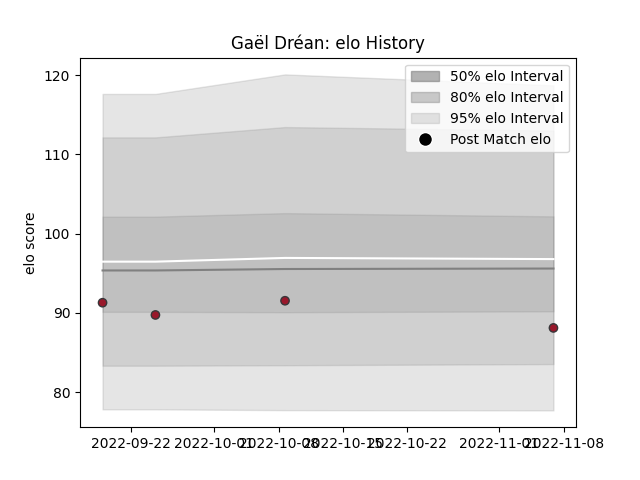

---  
layout: page  
title: Gaël Dréan  
date: 2023-01-13 11:23:37.270465  
categories: player  
---
# Gaël Dréan

## Positions: W

## Current elo: 88.0

## Current Percentile: 42.0

# Elo History

# Match History

| Team   |   Appearances |   Win Rate |
|:-------|--------------:|-----------:|
| Toulon |             9 |   0.555556 |

| Opponent             |   Matches |   Win Rate |
|:---------------------|----------:|-----------:|
| Brive                |         2 |        0.5 |
| Clermont Auvergne    |         1 |        1   |
| Lyon                 |         1 |        1   |
| Montpellier Herault  |         1 |        0   |
| Perpignan            |         1 |        0   |
| Racing 92            |         1 |        0   |
| Stade Francais Paris |         1 |        1   |
| Zebre                |         1 |        1   |