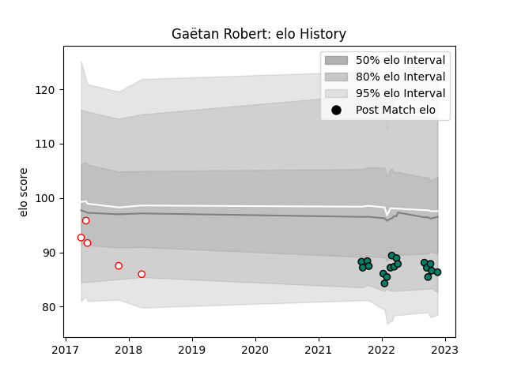

---  
layout: page  
title: Gaëtan Robert  
date: 2022-11-22 11:39:44.331156  
categories: player  
---
# Gaëtan Robert

## Positions: FH

## Current elo: 86.0

## Current Percentile: 16.0

# Elo History

# Match History

| Team     |   Appearances |   Win Rate |
|:---------|--------------:|-----------:|
| Suresnes |            18 |   0.388889 |
| Dax      |             5 |   0.2      |

| Opponent                   |   Matches |   Win Rate |
|:---------------------------|----------:|-----------:|
| Dax                        |         3 |   0.333333 |
| Blagnac                    |         2 |   0.5      |
| Bourgoin-Jallieu           |         2 |   0.5      |
| Cognac Saint Jean d'Angély |         2 |   1        |
| Valence Romans Drome Rugby |         2 |   0        |
| Aubenas                    |         1 |   0        |
| Rennes                     |         1 |   1        |
| US Bressane                |         1 |   0        |
| Tarbes                     |         1 |   1        |
| Soyaux-Angouleme           |         1 |   0        |
| Nevers                     |         1 |   0        |
| Oyonnax                    |         1 |   0        |
| Nice                       |         1 |   0        |
| Aurillac                   |         1 |   0        |
| Narbonne                   |         1 |   0        |
| Mont-de-Marsan             |         1 |   1        |
| Vannes                     |         1 |   0        |