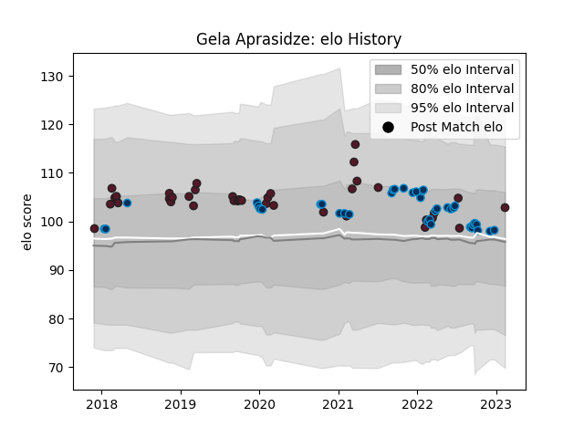

---  
layout: page  
title: Gela Aprasidze  
date: 2022-12-12 15:17:21.294683  
categories: player  
---
# Gela Aprasidze

## Positions: SH

## Country: Georgia

## Current elo: 103.0

## Current Percentile: 75.0

# Elo History

# Match History

| Team                |   Appearances |   Win Rate |
|:--------------------|--------------:|-----------:|
| Montpellier Herault |            34 |   0.544118 |
| Georgia             |            24 |   0.645833 |

| Opponent                 |   Matches |   Win Rate |
|:-------------------------|----------:|-----------:|
| Brive                    |         4 |   0.875    |
| Racing 92                |         3 |   0.333333 |
| Portugal                 |         3 |   0.833333 |
| Castres Olympique        |         3 |   0.333333 |
| Scotland                 |         3 |   0        |
| Agen                     |         2 |   1        |
| La Rochelle              |         2 |   0.5      |
| Romania                  |         2 |   1        |
| Spain                    |         2 |   1        |
| Pau                      |         2 |   1        |
| Stade Francais Paris     |         2 |   0.75     |
| Lyon                     |         2 |   0.5      |
| Stade Toulousain         |         2 |   0        |
| Toulon                   |         2 |   0.25     |
| Italy                    |         2 |   0.5      |
| Germany                  |         2 |   1        |
| Clermont Auvergne        |         2 |   0        |
| Bordeaux Begles          |         2 |   1        |
| Biarritz Olympique       |         2 |   1        |
| Belgium                  |         2 |   1        |
| United States of America |         1 |   1        |
| Uruguay                  |         1 |   1        |
| South Africa             |         1 |   0        |
| Netherlands              |         1 |   1        |
| Russia                   |         1 |   1        |
| Perpignan                |         1 |   1        |
| Australia                |         1 |   0        |
| Leinster                 |         1 |   0        |
| Gloucester Rugby         |         1 |   0        |
| Fiji                     |         1 |   0        |
| Exeter Chiefs            |         1 |   0        |
| Wales                    |         1 |   0        |