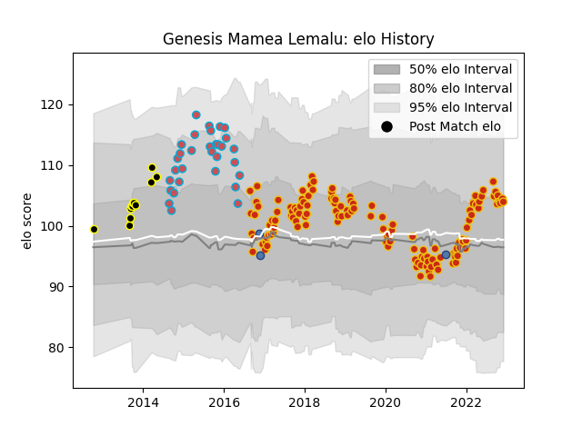

---  
layout: page  
title: Genesis Mamea Lemalu  
date: 2023-01-06 00:14:27.694914  
categories: player  
---
# Genesis Mamea Lemalu

## Positions: N8

## Country: Samoa

## Current elo: 117.0

## Current Percentile: 84.0

# Elo History

# Match History

| Team             |   Appearances |   Win Rate |
|:-----------------|--------------:|-----------:|
| Perpignan        |           138 |   0.539855 |
| Bourgoin-Jallieu |            42 |   0.464286 |
| Mont-de-Marsan   |            11 |   0.545455 |
| Wellington       |             9 |   0.777778 |
| Samoa            |             4 |   0.25     |

| Opponent                   |   Matches |   Win Rate |
|:---------------------------|----------:|-----------:|
| Biarritz Olympique         |        11 |   0.636364 |
| Carcassonne                |        10 |   0.7      |
| Colomiers                  |         9 |   0.444444 |
| Aurillac                   |         9 |   0.722222 |
| Beziers                    |         9 |   0.333333 |
| Montauban                  |         8 |   0.75     |
| Mont-de-Marsan             |         8 |   0.5      |
| Dax                        |         8 |   0.6875   |
| Lyon                       |         7 |   0.142857 |
| Grenoble                   |         7 |   0.714286 |
| Narbonne                   |         7 |   0.785714 |
| Pau                        |         7 |   0        |
| Vannes                     |         6 |   0.833333 |
| Montpellier Herault        |         5 |   0.2      |
| Toulon                     |         5 |   0.4      |
| Stade Francais Paris       |         4 |   0        |
| Massy                      |         4 |   0.5      |
| Albi                       |         4 |   0.25     |
| Oyonnax                    |         4 |   0.75     |
| Soyaux-Angouleme           |         4 |   0.875    |
| Agen                       |         4 |   0.5      |
| Stade Toulousain           |         4 |   0.25     |
| Provence Rugby             |         4 |   0.5      |
| Castres Olympique          |         4 |   0        |
| Tarbes                     |         4 |   0.75     |
| Bourgoin-Jallieu           |         3 |   0.666667 |
| Perpignan                  |         3 |   0.333333 |
| Nevers                     |         3 |   1        |
| Bordeaux Begles            |         3 |   0.666667 |
| Racing 92                  |         3 |   0.333333 |
| Brive                      |         3 |   0.333333 |
| La Rochelle                |         3 |   0.333333 |
| Bayonne                    |         3 |   0.666667 |
| Canterbury                 |         2 |   0.5      |
| Clermont Auvergne          |         2 |   0.5      |
| Sale Sharks                |         2 |   0        |
| Rouen                      |         2 |   1        |
| Roval Drome XV             |         1 |   1        |
| US Bressane                |         1 |   1        |
| Valence Romans Drome Rugby |         1 |   1        |
| Manawatu                   |         1 |   1        |
| Otago                      |         1 |   1        |
| Northland                  |         1 |   1        |
| New Zealand Maori          |         1 |   0        |
| Hawke's Bay                |         1 |   0        |
| Glasgow Warriors           |         1 |   0        |
| Georgia                    |         1 |   0        |
| France                     |         1 |   0        |
| Canada                     |         1 |   1        |
| Bay of Plenty              |         1 |   1        |
| Auckland                   |         1 |   1        |
| Auch                       |         1 |   1        |
| Waikato                    |         1 |   1        |