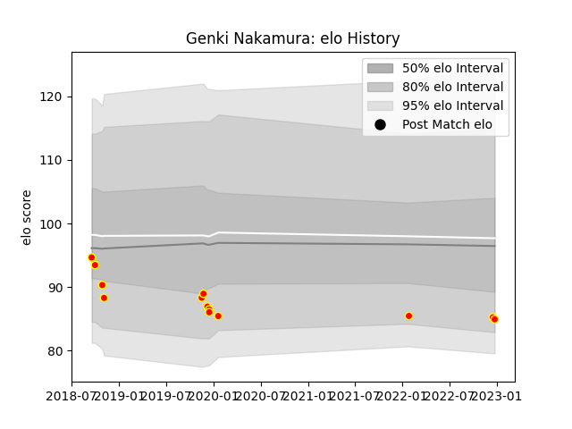

---  
layout: page  
title: Genki Nakamura  
date: 2022-12-28 12:53:49.925629  
categories: player  
---
# Genki Nakamura

## Positions: N8

## Current elo: 85.0

## Current Percentile: None

# Elo History

# Match History

| Team          |   Appearances |   Win Rate |
|:--------------|--------------:|-----------:|
| Kyuden Voltex |            13 |   0.230769 |

| Opponent                         |   Matches |   Win Rate |
|:---------------------------------|----------:|-----------:|
| Hanazono Kintetsu Liners         |         3 |        0   |
| Kamaishi Seawaves                |         2 |        0.5 |
| Kurita Water Gush                |         2 |        0.5 |
| Mazda Blue Zoomers               |         2 |        0   |
| Mitsubishi Dynaboars             |         1 |        0   |
| NTT Docomo Red Hurricanes Osaka  |         1 |        0   |
| Shimizu Blue Sharks              |         1 |        1   |
| Toyota Industries Shuttles Aichi |         1 |        0   |