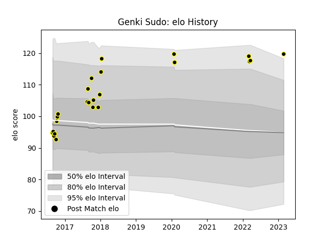

---  
layout: page  
title: Genki Sudo  
date: 2023-02-28 11:04:25.620525  
categories: player  
---
# Genki Sudo

## Positions: P

## Current elo: 120.0

## Current Percentile: 94.0

# Elo History

# Match History

| Team             |   Appearances |   Win Rate |
|:-----------------|--------------:|-----------:|
| Tokyo Sungoliath |            24 |   0.916667 |

| Opponent                          |   Matches |   Win Rate |
|:----------------------------------|----------:|-----------:|
| Green Rockets Tokatsu             |         3 |   1        |
| Saitama Wild Knights              |         3 |   0.666667 |
| Shizuoka Blue Revs                |         3 |   1        |
| Black Rams Tokyo                  |         2 |   1        |
| Kobelco Kobe Steelers             |         2 |   0.5      |
| Yokohama Canon Eagles             |         2 |   1        |
| Hanazono Kintetsu Liners          |         1 |   1        |
| Kubota Spears Funabashi Tokyo-Bay |         1 |   1        |
| Mie Honda Heat                    |         1 |   1        |
| Munakata Sanix Blues              |         1 |   1        |
| NTT Docomo Red Hurricanes Osaka   |         1 |   1        |
| Toshiba Brave Lupus Tokyo         |         1 |   1        |
| Toyota Industries Shuttles Aichi  |         1 |   1        |
| Toyota Verblitz                   |         1 |   1        |
| Urayasu D-Rocks                   |         1 |   1        |