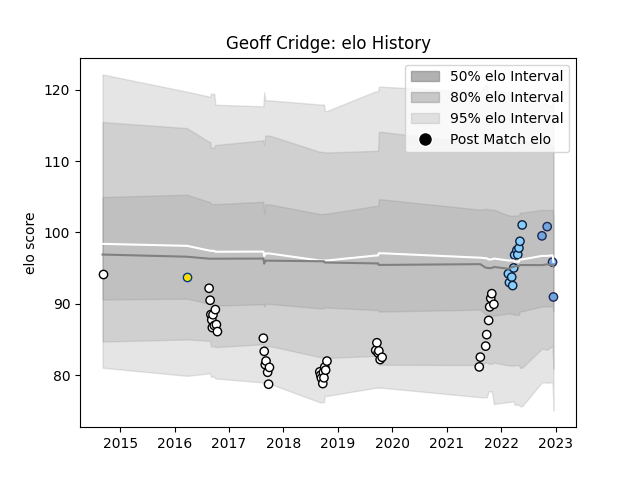

---  
layout: page  
title: Geoff Cridge  
date: 2023-01-06 00:15:00.701554  
categories: player  
---
# Geoff Cridge

## Positions: L, FL

## Current elo: 101.0

## Current Percentile: 31.0

# Elo History

# Match History

| Team                     |   Appearances |   Win Rate |
|:-------------------------|--------------:|-----------:|
| Hawke's Bay              |            42 |   0.380952 |
| New South Wales Waratahs |            11 |   0.727273 |
| Bayonne                  |             6 |   0.416667 |
| Hurricanes               |             1 |   1        |

| Opponent          |   Matches |   Win Rate |
|:------------------|----------:|-----------:|
| Bay of Plenty     |         6 |   0.333333 |
| Tasman            |         5 |   0.2      |
| Waikato           |         4 |   0.5      |
| Canterbury        |         4 |   0.25     |
| Taranaki          |         4 |   0.25     |
| Counties Manukau  |         4 |   0.25     |
| Wellington        |         3 |   0.333333 |
| Manawatu          |         3 |   1        |
| North Harbour     |         2 |   0        |
| Southland         |         2 |   1        |
| Queensland Reds   |         2 |   0        |
| Otago             |         2 |   0.5      |
| Northland         |         2 |   0.5      |
| Western Force     |         2 |   1        |
| Fijian Drua       |         2 |   1        |
| Moana Pasifika    |         1 |   1        |
| Melbourne Rebels  |         1 |   1        |
| Highlanders       |         1 |   1        |
| Pau               |         1 |   0.5      |
| Scarlets          |         1 |   0        |
| Southern Kings    |         1 |   1        |
| Crusaders         |         1 |   1        |
| Clermont Auvergne |         1 |   1        |
| Chiefs            |         1 |   0        |
| Toulon            |         1 |   1        |
| Brive             |         1 |   0        |
| Benetton Treviso  |         1 |   0        |
| Auckland          |         1 |   0        |