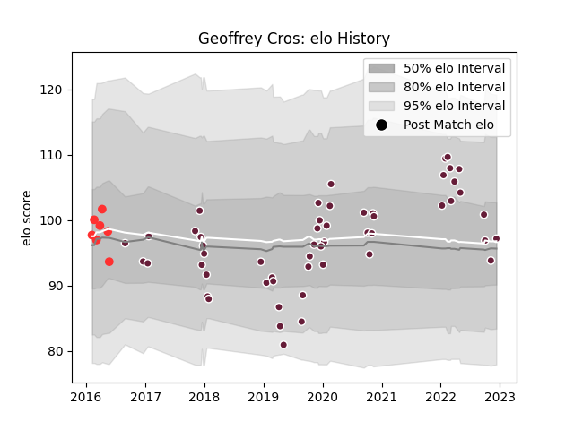

---  
layout: page  
title: Geoffrey Cros  
date: 2023-01-17 11:37:40.598941  
categories: player  
---
# Geoffrey Cros

## Positions: W, FB

## Current elo: 85.0

## Current Percentile: 19.0

# Elo History

# Match History

| Team            |   Appearances |   Win Rate |
|:----------------|--------------:|-----------:|
| Bordeaux Begles |            56 |   0.517857 |
| Tarbes          |             9 |   0.444444 |

| Opponent             |   Matches |   Win Rate |
|:---------------------|----------:|-----------:|
| Lyon                 |         5 |   0.4      |
| Stade Toulousain     |         5 |   0.2      |
| Pau                  |         4 |   0        |
| Agen                 |         4 |   1        |
| Toulon               |         4 |   0.25     |
| Bayonne              |         3 |   0.666667 |
| Stade Francais Paris |         3 |   0.666667 |
| Brive                |         3 |   0.666667 |
| Castres Olympique    |         3 |   0.666667 |
| Clermont Auvergne    |         3 |   0.666667 |
| Sharks               |         2 |   0        |
| Montpellier Herault  |         2 |   0.5      |
| Dragons              |         2 |   0.5      |
| La Rochelle          |         2 |   1        |
| Scarlets             |         1 |   1        |
| Sale Sharks          |         1 |   1        |
| Racing 92            |         1 |   1        |
| RC Enisei            |         1 |   1        |
| Perpignan            |         1 |   1        |
| Newcastle Falcons    |         1 |   0        |
| Grenoble             |         1 |   1        |
| Mont-de-Marsan       |         1 |   1        |
| Albi                 |         1 |   0        |
| Gloucester Rugby     |         1 |   0        |
| Exeter Chiefs        |         1 |   0        |
| Edinburgh            |         1 |   1        |
| Dax                  |         1 |   1        |
| Connacht             |         1 |   0        |
| Carcassonne          |         1 |   1        |
| Bourgoin-Jallieu     |         1 |   0        |
| Biarritz Olympique   |         1 |   0        |
| Beziers              |         1 |   0        |
| Aurillac             |         1 |   0        |
| Ulster               |         1 |   1        |