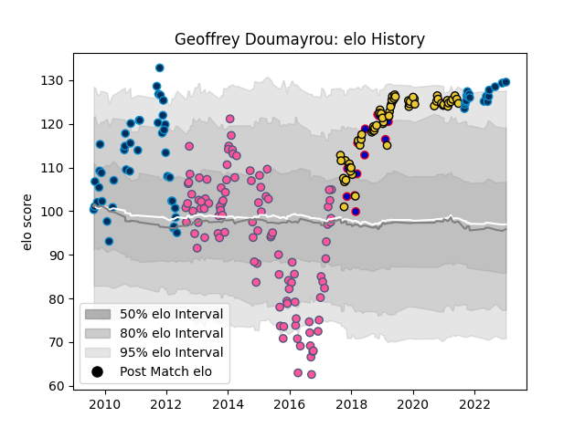

---  
layout: page  
title: Geoffrey Doumayrou  
date: 2023-01-13 11:33:37.142271  
categories: player  
---
# Geoffrey Doumayrou

## Positions: C

## Country: France

## Current elo: 130.0

## Current Percentile: 95.0

# Elo History

# Match History

| Team                 |   Appearances |   Win Rate |
|:---------------------|--------------:|-----------:|
| Stade Francais Paris |           101 |   0.534653 |
| La Rochelle          |            63 |   0.619048 |
| Montpellier Herault  |            60 |   0.616667 |
| France               |            13 |   0.230769 |

| Opponent             |   Matches |   Win Rate |
|:---------------------|----------:|-----------:|
| Stade Toulousain     |        19 |   0.184211 |
| Clermont Auvergne    |        16 |   0.40625  |
| Castres Olympique    |        16 |   0.53125  |
| Racing 92            |        15 |   0.533333 |
| Bordeaux Begles      |        15 |   0.466667 |
| Toulon               |        14 |   0.535714 |
| Bayonne              |        10 |   0.7      |
| Montpellier Herault  |        10 |   0.4      |
| Brive                |        10 |   0.6      |
| Grenoble             |         8 |   0.625    |
| Pau                  |         8 |   0.625    |
| La Rochelle          |         7 |   0.5      |
| Lyon                 |         7 |   0.571429 |
| Perpignan            |         7 |   1        |
| Oyonnax              |         5 |   0.6      |
| Agen                 |         5 |   1        |
| Stade Francais Paris |         5 |   0.7      |
| Biarritz Olympique   |         4 |   1        |
| Bath Rugby           |         4 |   0.75     |
| Sale Sharks          |         3 |   0.666667 |
| New Zealand          |         3 |   0        |
| South Africa         |         2 |   0        |
| Ulster               |         2 |   0.5      |
| Wales                |         2 |   0        |
| Wasps                |         2 |   0.5      |
| Montauban            |         2 |   1        |
| Leicester Tigers     |         2 |   0.5      |
| Zebre                |         2 |   1        |
| England              |         2 |   0.5      |
| Leinster             |         2 |   0.25     |
| Bourgoin-Jallieu     |         2 |   1        |
| Albi                 |         2 |   1        |
| Italy                |         2 |   1        |
| Bristol Rugby        |         2 |   1        |
| Cavalieri Prato      |         2 |   1        |
| Dragons              |         2 |   0        |
| Exeter Chiefs        |         2 |   0        |
| Benetton Treviso     |         1 |   1        |
| Bucuresti            |         1 |   1        |
| Edinburgh            |         1 |   1        |
| Scotland             |         1 |   0        |
| London Irish         |         1 |   1        |
| London Welsh         |         1 |   1        |
| Glasgow Warriors     |         1 |   0.5      |
| Gloucester Rugby     |         1 |   1        |
| Ospreys              |         1 |   1        |
| Newcastle Falcons    |         1 |   1        |
| Harlequins           |         1 |   1        |
| Mont-de-Marsan       |         1 |   1        |
| Lusitanos XV         |         1 |   1        |
| Fiji                 |         1 |   0        |