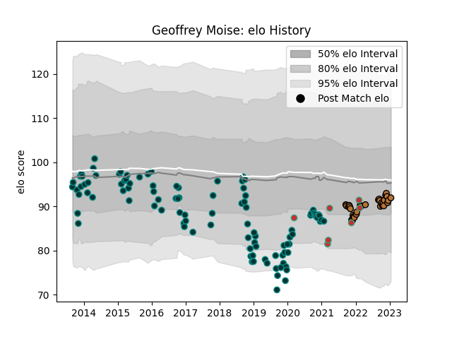

---  
layout: page  
title: Geoffrey Moise  
date: 2023-02-02 18:50:12.673324  
categories: player  
---
# Geoffrey Moise

## Positions: P

## Country: Portugal

## Current elo: 91.0

## Current Percentile: 41.0

# Elo History

# Match History

| Team     |   Appearances |   Win Rate |
|:---------|--------------:|-----------:|
| Pau      |           101 |   0.465347 |
| Narbonne |            33 |   0.378788 |
| Portugal |             7 |   0.214286 |

| Opponent                   |   Matches |   Win Rate |
|:---------------------------|----------:|-----------:|
| Agen                       |         8 |   0.75     |
| Stade Francais Paris       |         7 |   0.285714 |
| La Rochelle                |         6 |   0.166667 |
| Stade Toulousain           |         5 |   0        |
| Clermont Auvergne          |         5 |   0.2      |
| Castres Olympique          |         5 |   0.2      |
| Carcassonne                |         5 |   0.4      |
| Albi                       |         5 |   0.4      |
| Aurillac                   |         4 |   0.5      |
| Montpellier Herault        |         4 |   0.5      |
| Bourgoin-Jallieu           |         4 |   0.5      |
| Brive                      |         4 |   0.25     |
| Toulon                     |         4 |   0.25     |
| Grenoble                   |         4 |   0.625    |
| Bordeaux Begles            |         4 |   0.5      |
| Lyon                       |         4 |   0.125    |
| Beziers                    |         3 |   0.666667 |
| US Bressane                |         3 |   0.666667 |
| Cardiff Blues              |         3 |   0.333333 |
| Perpignan                  |         3 |   0.666667 |
| Georgia                    |         3 |   0.166667 |
| Suresnes                   |         2 |   1        |
| Nice                       |         2 |   1        |
| Ospreys                    |         2 |   0.5      |
| Worcester Warriors         |         2 |   0.5      |
| Romania                    |         2 |   0        |
| Sale Sharks                |         2 |   0        |
| Leicester Tigers           |         2 |   0.5      |
| Auch                       |         2 |   0.5      |
| Dax                        |         2 |   0.5      |
| Bayonne                    |         2 |   0.5      |
| Colomiers                  |         2 |   0.5      |
| Bristol Rugby              |         2 |   0        |
| Japan                      |         1 |   0        |
| Rouen                      |         1 |   1        |
| Vannes                     |         1 |   0.5      |
| Valence Romans Drome Rugby |         1 |   0        |
| Bath Rugby                 |         1 |   0        |
| Tarbes                     |         1 |   0        |
| Biarritz Olympique         |         1 |   1        |
| Blagnac                    |         1 |   0.5      |
| Spain                      |         1 |   1        |
| Calvisano                  |         1 |   1        |
| Rennes                     |         1 |   1        |
| Carqueiranne-Hyères        |         1 |   1        |
| Gloucester Rugby           |         1 |   1        |
| Racing 92                  |         1 |   0        |
| Provence Rugby             |         1 |   1        |
| Chambery                   |         1 |   0        |
| Oyonnax                    |         1 |   0        |
| Cognac Saint Jean d'Angély |         1 |   1        |
| Nevers                     |         1 |   0        |
| Narbonne                   |         1 |   1        |
| Montauban                  |         1 |   1        |
| Mont-de-Marsan             |         1 |   0.5      |
| Massy                      |         1 |   1        |
| Zebre                      |         1 |   1        |