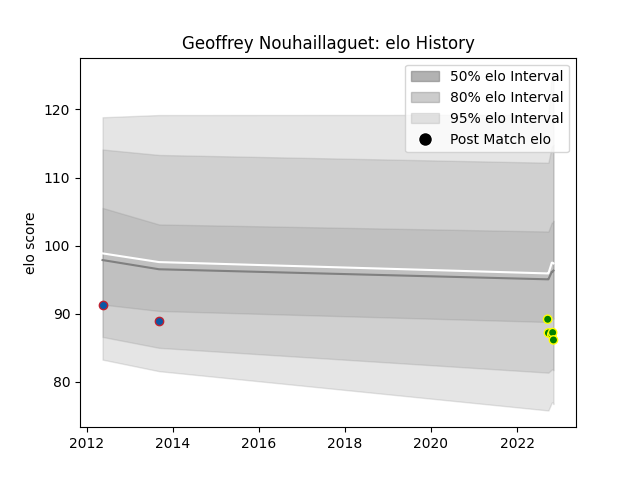

---  
layout: page  
title: Geoffrey Nouhaillaguet  
date: 2022-12-18 16:27:52.350511  
categories: player  
---
# Geoffrey Nouhaillaguet

## Positions: L, FL

## Current elo: 86.0

## Current Percentile: 17.0

# Elo History

# Match History

| Team                |   Appearances |   Win Rate |
|:--------------------|--------------:|-----------:|
| Carqueiranne-Hyères |             7 |   0.428571 |
| Grenoble            |             2 |   0        |

| Opponent                   |   Matches |   Win Rate |
|:---------------------------|----------:|-----------:|
| Albi                       |         1 |          1 |
| Blagnac                    |         1 |          0 |
| Chambery                   |         1 |          1 |
| Cognac Saint Jean d'Angély |         1 |          1 |
| Dax                        |         1 |          0 |
| Nice                       |         1 |          0 |
| Oyonnax                    |         1 |          0 |
| Perpignan                  |         1 |          0 |
| Valence Romans Drome Rugby |         1 |          0 |