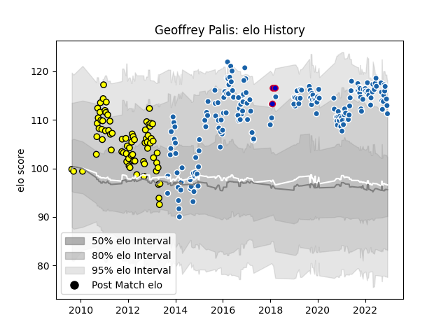

---  
layout: page  
title: Geoffrey Palis  
date: 2023-01-06 00:10:08.558523  
categories: player  
---
# Geoffrey Palis

## Positions: FB, W

## Country: France

## Current elo: 118.0

## Current Percentile: 88.0

# Elo History

# Match History

| Team              |   Appearances |   Win Rate |
|:------------------|--------------:|-----------:|
| Castres Olympique |           181 |   0.560773 |
| Albi              |            77 |   0.512987 |
| France            |             3 |   0        |

| Opponent             |   Matches |   Win Rate |
|:---------------------|----------:|-----------:|
| La Rochelle          |        15 |   0.4      |
| Pau                  |        15 |   0.666667 |
| Bordeaux Begles      |        15 |   0.433333 |
| Stade Toulousain     |        15 |   0.366667 |
| Racing 92            |        14 |   0.392857 |
| Brive                |        14 |   0.571429 |
| Clermont Auvergne    |        14 |   0.5      |
| Montpellier Herault  |        13 |   0.615385 |
| Lyon                 |        12 |   0.583333 |
| Toulon               |        12 |   0.5      |
| Grenoble             |        11 |   0.5      |
| Stade Francais Paris |        11 |   0.454545 |
| Oyonnax              |         8 |   0.75     |
| Auch                 |         6 |   0.416667 |
| Bayonne              |         6 |   0.75     |
| Dax                  |         5 |   0.6      |
| Carcassonne          |         5 |   0.6      |
| Tarbes               |         5 |   0.8      |
| Narbonne             |         5 |   0.4      |
| Aurillac             |         5 |   0.7      |
| Agen                 |         5 |   1        |
| Provence Rugby       |         4 |   0.75     |
| Mont-de-Marsan       |         4 |   0.25     |
| Biarritz Olympique   |         4 |   0.875    |
| Colomiers            |         4 |   0.75     |
| Northampton Saints   |         3 |   0.666667 |
| Beziers              |         3 |   0.666667 |
| Perpignan            |         3 |   1        |
| Leinster             |         3 |   0        |
| Worcester Warriors   |         2 |   1        |
| Ospreys              |         2 |   0.5      |
| Exeter Chiefs        |         2 |   0        |
| Dragons              |         2 |   0.5      |
| Saint-Etienne        |         2 |   1        |
| Scotland             |         1 |   0        |
| Wasps                |         1 |   0        |
| Wales                |         1 |   0        |
| Bourgoin-Jallieu     |         1 |   1        |
| Massy                |         1 |   1        |
| Sale Sharks          |         1 |   0        |
| Périgueux            |         1 |   0        |
| Harlequins           |         1 |   0        |
| Ireland              |         1 |   0        |
| Leicester Tigers     |         1 |   1        |
| Munster              |         1 |   0        |
| RC Enisei            |         1 |   1        |