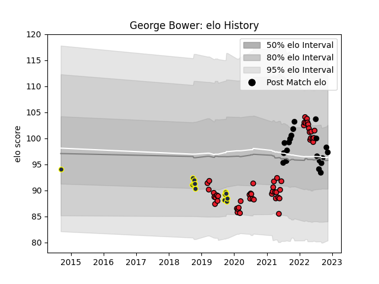

---  
layout: page  
title: George Bower  
date: 2022-11-15 23:37:46.198021  
categories: player  
---
# George Bower

## Positions: P

## Country: New Zealand

## Current elo: 97.0

## Current Percentile: 59.0

# Elo History

# Match History

| Team        |   Appearances |   Win Rate |
|:------------|--------------:|-----------:|
| Crusaders   |            52 |   0.817308 |
| New Zealand |            20 |   0.75     |
| Otago       |            13 |   0.384615 |

| Opponent                 |   Matches |   Win Rate |
|:-------------------------|----------:|-----------:|
| Chiefs                   |        11 |   0.636364 |
| Highlanders              |         8 |   0.875    |
| Hurricanes               |         8 |   0.875    |
| Blues                    |         7 |   0.857143 |
| Australia                |         4 |   1        |
| Queensland Reds          |         4 |   1        |
| New South Wales Waratahs |         4 |   0.5      |
| Argentina                |         3 |   0.666667 |
| Ireland                  |         3 |   0.333333 |
| Waikato                  |         3 |   0.666667 |
| South Africa             |         3 |   0.333333 |
| Melbourne Rebels         |         3 |   1        |
| Brumbies                 |         2 |   1        |
| Hawke's Bay              |         2 |   0.5      |
| Northland                |         2 |   0        |
| Fiji                     |         2 |   1        |
| Canterbury               |         2 |   0        |
| Italy                    |         1 |   1        |
| Sunwolves                |         1 |   1        |
| Wellington               |         1 |   0        |
| United States of America |         1 |   1        |
| Tonga                    |         1 |   1        |
| Tasman                   |         1 |   0        |
| Scotland                 |         1 |   1        |
| Stormers                 |         1 |   0.5      |
| Jaguares                 |         1 |   1        |
| North Harbour            |         1 |   1        |
| Moana Pasifika           |         1 |   1        |
| Auckland                 |         1 |   1        |
| Japan                    |         1 |   1        |
| Western Force            |         1 |   1        |