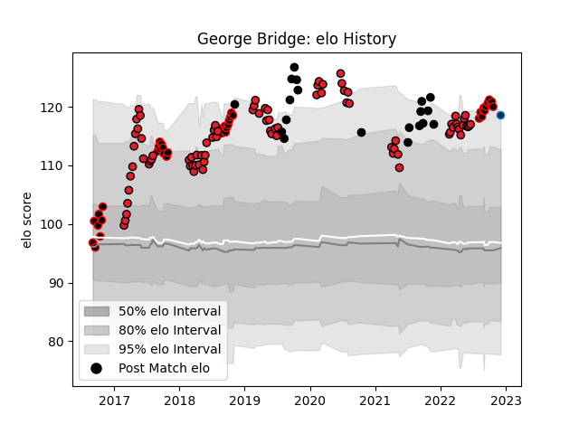

---  
layout: page  
title: George Bridge  
date: 2023-02-02 18:54:51.035921  
categories: player  
---
# George Bridge

## Positions: W, FB

## Country: New Zealand

## Current elo: 124.0

## Current Percentile: 94.0

# Elo History

# Match History

| Team                |   Appearances |   Win Rate |
|:--------------------|--------------:|-----------:|
| Crusaders           |            83 |   0.843373 |
| Canterbury          |            40 |   0.8      |
| New Zealand         |            19 |   0.789474 |
| Montpellier Herault |             5 |   0.4      |

| Opponent                 |   Matches |   Win Rate |
|:-------------------------|----------:|-----------:|
| Chiefs                   |        13 |   0.692308 |
| Hurricanes               |        12 |   0.75     |
| Highlanders              |        11 |   0.818182 |
| Blues                    |        10 |   0.9      |
| Queensland Reds          |         5 |   1        |
| North Harbour            |         5 |   1        |
| Tasman                   |         4 |   1        |
| Counties Manukau         |         4 |   0.75     |
| Taranaki                 |         4 |   0.5      |
| Hawke's Bay              |         4 |   1        |
| Lions                    |         4 |   1        |
| Wellington               |         4 |   0.5      |
| Australia                |         4 |   0.625    |
| Auckland                 |         3 |   0.333333 |
| Manawatu                 |         3 |   0.666667 |
| Northland                |         3 |   1        |
| Stormers                 |         3 |   0.833333 |
| Melbourne Rebels         |         3 |   1        |
| South Africa             |         3 |   0.833333 |
| New South Wales Waratahs |         3 |   0.666667 |
| Sunwolves                |         3 |   1        |
| Bulls                    |         3 |   1        |
| Brumbies                 |         3 |   1        |
| Sharks                   |         2 |   0.75     |
| Otago                    |         2 |   1        |
| Tonga                    |         2 |   1        |
| Argentina                |         2 |   1        |
| Western Force            |         2 |   1        |
| Bay of Plenty            |         2 |   1        |
| Jaguares                 |         2 |   1        |
| Namibia                  |         1 |   1        |
| Stade Toulousain         |         1 |   0        |
| Waikato                  |         1 |   1        |
| United States of America |         1 |   1        |
| British and Irish Lions  |         1 |   0        |
| Cheetahs                 |         1 |   1        |
| Clermont Auvergne        |         1 |   0        |
| England                  |         1 |   0        |
| Fiji                     |         1 |   1        |
| Southland                |         1 |   1        |
| Moana Pasifika           |         1 |   1        |
| Fijian Drua              |         1 |   1        |
| France                   |         1 |   0        |
| Ireland                  |         1 |   1        |
| Perpignan                |         1 |   1        |
| Italy                    |         1 |   1        |
| Ospreys                  |         1 |   0        |
| Japan                    |         1 |   1        |
| London Irish             |         1 |   1        |