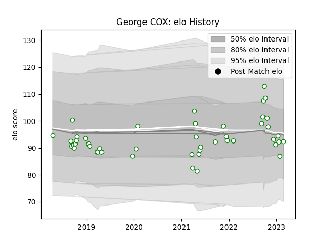

---  
layout: page  
title: George COX  
date: 2023-03-09 10:07:38.797348  
categories: player  
---
# George COX

## Positions: FL

## Current elo: 76.0

## Current Percentile: 14.0

# Elo History

# Match History

| Team       |   Appearances |   Win Rate |
|:-----------|--------------:|-----------:|
| Nottingham |            49 |   0.316327 |

| Opponent            |   Matches |   Win Rate |
|:--------------------|----------:|-----------:|
| Doncaster           |         6 |   0.333333 |
| Coventry            |         5 |   0.3      |
| Jersey              |         5 |   0        |
| Ampthill            |         4 |   0.25     |
| Cornish Pirates     |         4 |   0        |
| Hartpury College    |         4 |   0.25     |
| London Scottish     |         4 |   0.75     |
| Richmond            |         4 |   0.75     |
| Bedford             |         3 |   0.333333 |
| Caldy               |         2 |   0.5      |
| Ealing Trailfinders |         2 |   0        |
| London Irish        |         2 |   0        |
| Yorkshire Carnegie  |         2 |   1        |
| Newcastle Falcons   |         1 |   0        |
| Saracens            |         1 |   0        |