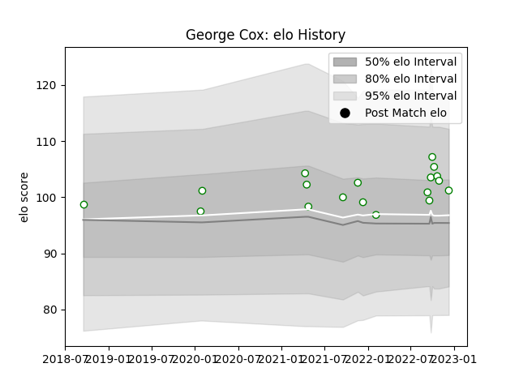

---  
layout: page  
title: George Cox  
date: 2022-12-14 11:12:16.149753  
categories: player  
---
# George Cox

## Positions: FL

## Current elo: 101.0

## Current Percentile: 74.0

# Elo History

# Match History

| Team       |   Appearances |   Win Rate |
|:-----------|--------------:|-----------:|
| Nottingham |            18 |   0.444444 |

| Opponent            |   Matches |   Win Rate |
|:--------------------|----------:|-----------:|
| Jersey              |         3 |        0   |
| London Scottish     |         3 |        1   |
| Cornish Pirates     |         2 |        0   |
| Doncaster           |         2 |        0.5 |
| Hartpury College    |         2 |        0   |
| Ampthill            |         1 |        1   |
| Caldy               |         1 |        1   |
| Ealing Trailfinders |         1 |        0   |
| Newcastle Falcons   |         1 |        0   |
| Richmond            |         1 |        1   |
| Yorkshire Carnegie  |         1 |        1   |