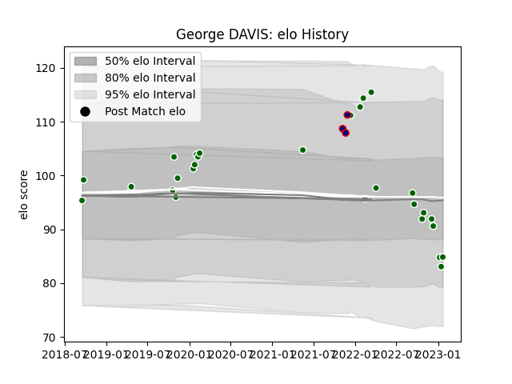

---  
layout: page  
title: George DAVIS  
date: 2023-03-29 11:28:26.317768  
categories: player  
---
# George DAVIS

Last updated: 2023-03-29
## Positions: P

## Current elo: 100.0

## Current Percentile: 54.0

# Elo History

# Match History

| Team                |   Appearances |   Win Rate |
|:--------------------|--------------:|-----------:|
| Ealing Trailfinders |            33 |   0.924242 |
| London Scottish     |             3 |   0.333333 |

| Opponent           |   Matches |   Win Rate |
|:-------------------|----------:|-----------:|
| Bedford            |         6 |   0.833333 |
| Ampthill           |         4 |   1        |
| Cornish Pirates    |         3 |   0.666667 |
| Coventry           |         3 |   0.833333 |
| Hartpury College   |         3 |   1        |
| Jersey             |         3 |   1        |
| London Scottish    |         3 |   1        |
| Nottingham         |         3 |   0.666667 |
| Richmond           |         3 |   1        |
| Doncaster          |         2 |   1        |
| Yorkshire Carnegie |         2 |   1        |
| Caldy              |         1 |   0        |