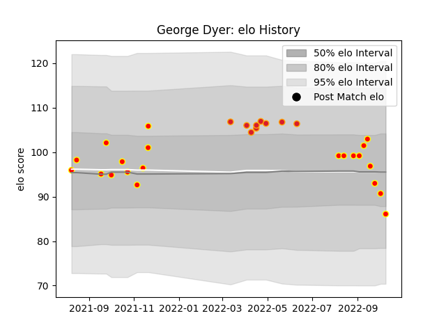

---  
layout: page  
title: George Dyer  
date: 2023-02-24 09:55:57.469274  
categories: player  
---
# George Dyer

## Positions: P

## Current elo: 86.0

## Current Percentile: 54.0

# Elo History

# Match History

| Team    |   Appearances |   Win Rate |
|:--------|--------------:|-----------:|
| Waikato |            21 |   0.642857 |
| Chiefs  |             9 |   0.777778 |

| Opponent                 |   Matches |   Win Rate |
|:-------------------------|----------:|-----------:|
| Tasman                   |         3 |       1    |
| Wellington               |         2 |       0.5  |
| Canterbury               |         2 |       0.5  |
| Crusaders                |         2 |       0.5  |
| Hawke's Bay              |         2 |       0.25 |
| Taranaki                 |         2 |       0.5  |
| Moana Pasifika           |         2 |       1    |
| Bay of Plenty            |         2 |       0.5  |
| Northland                |         2 |       0.5  |
| Otago                    |         2 |       0.5  |
| Auckland                 |         1 |       1    |
| Queensland Reds          |         1 |       1    |
| Southland                |         1 |       1    |
| New South Wales Waratahs |         1 |       1    |
| North Harbour            |         1 |       1    |
| Manawatu                 |         1 |       1    |
| Hurricanes               |         1 |       1    |
| Blues                    |         1 |       0    |
| Western Force            |         1 |       1    |