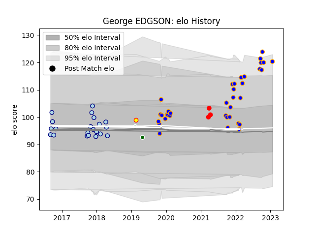

---  
layout: page  
title: George EDGSON  
date: 2023-03-06 11:24:48.287394  
categories: player  
---
# George EDGSON

## Positions: H, FL

## Current elo: 117.0

## Current Percentile: 95.0

# Elo History

# Match History

| Team                |   Appearances |   Win Rate |
|:--------------------|--------------:|-----------:|
| Doncaster           |            38 |   0.631579 |
| Bedford             |            21 |   0.333333 |
| Jersey              |             3 |   0.333333 |
| Ealing Trailfinders |             2 |   0.5      |
| Richmond            |             1 |   0        |

| Opponent            |   Matches |   Win Rate |
|:--------------------|----------:|-----------:|
| Cornish Pirates     |         7 |   0.142857 |
| Jersey              |         7 |   0.428571 |
| Nottingham          |         7 |   0.714286 |
| Bedford             |         6 |   0.666667 |
| Ealing Trailfinders |         6 |   0.333333 |
| Hartpury College    |         6 |   0.833333 |
| Richmond            |         5 |   0.8      |
| Doncaster           |         4 |   0.375    |
| Ampthill            |         3 |   0.666667 |
| Coventry            |         3 |   0.333333 |
| Bristol Rugby       |         2 |   0        |
| London Irish        |         2 |   0        |
| London Scottish     |         2 |   0.75     |
| Rotherham Titans    |         2 |   1        |
| Yorkshire Carnegie  |         2 |   0.5      |
| Newcastle Falcons   |         1 |   0        |