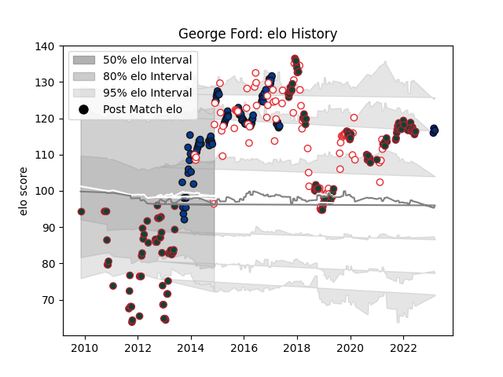

---  
layout: page  
title: George Ford  
date: 2023-03-17 17:22:53.462554  
categories: player  
---
# George Ford

## Positions: FH

## Country: England

## Current elo: 96.0

## Current Percentile: 79.0

# Elo History

# Match History

| Team             |   Appearances |   Win Rate |
|:-----------------|--------------:|-----------:|
| Leicester Tigers |           145 |   0.568966 |
| Bath Rugby       |            92 |   0.608696 |
| England          |            82 |   0.70122  |
| Sale Sharks      |             3 |   0        |

| Opponent                 |   Matches |   Win Rate |
|:-------------------------|----------:|-----------:|
| Exeter Chiefs            |        21 |   0.52381  |
| Northampton Saints       |        21 |   0.452381 |
| Harlequins               |        20 |   0.475    |
| Saracens                 |        18 |   0.305556 |
| Gloucester Rugby         |        16 |   0.8125   |
| Wasps                    |        16 |   0.4375   |
| Newcastle Falcons        |        16 |   0.8125   |
| Wales                    |        13 |   0.692308 |
| Sale Sharks              |        13 |   0.615385 |
| London Irish             |        12 |   0.916667 |
| Ireland                  |        11 |   0.545455 |
| Bath Rugby               |        10 |   0.5      |
| Leicester Tigers         |         9 |   0.611111 |
| France                   |         9 |   0.555556 |
| Italy                    |         9 |   1        |
| Worcester Warriors       |         9 |   0.777778 |
| Australia                |         9 |   0.888889 |
| Scotland                 |         8 |   0.5625   |
| Bristol Rugby            |         6 |   0.666667 |
| South Africa             |         6 |   0.333333 |
| Argentina                |         5 |   1        |
| Racing 92                |         4 |   0        |
| Stade Toulousain         |         4 |   0.5      |
| Leinster                 |         4 |   0.25     |
| Toulon                   |         4 |   0        |
| Montpellier Herault      |         3 |   0.666667 |
| Ospreys                  |         3 |   0.5      |
| New Zealand              |         3 |   0.333333 |
| London Welsh             |         3 |   1        |
| Ulster                   |         3 |   0.333333 |
| Bordeaux Begles          |         3 |   1        |
| Munster                  |         2 |   0        |
| Glasgow Warriors         |         2 |   0.5      |
| Fiji                     |         2 |   1        |
| Pau                      |         2 |   1        |
| Clermont Auvergne        |         2 |   1        |
| Samoa                    |         2 |   1        |
| Cardiff Blues            |         2 |   1        |
| Scarlets                 |         2 |   0.5      |
| Benetton Treviso         |         2 |   1        |
| United States of America |         1 |   1        |
| Uruguay                  |         1 |   1        |
| Tonga                    |         1 |   1        |
| Aironi                   |         1 |   1        |
| Stade Francais Paris     |         1 |   0        |
| Mogliano                 |         1 |   1        |
| Japan                    |         1 |   1        |
| Dragons                  |         1 |   1        |
| Castres Olympique        |         1 |   1        |
| Calvisano                |         1 |   1        |
| Brive                    |         1 |   1        |
| Barbarians               |         1 |   0        |
| Yorkshire Carnegie       |         1 |   0        |