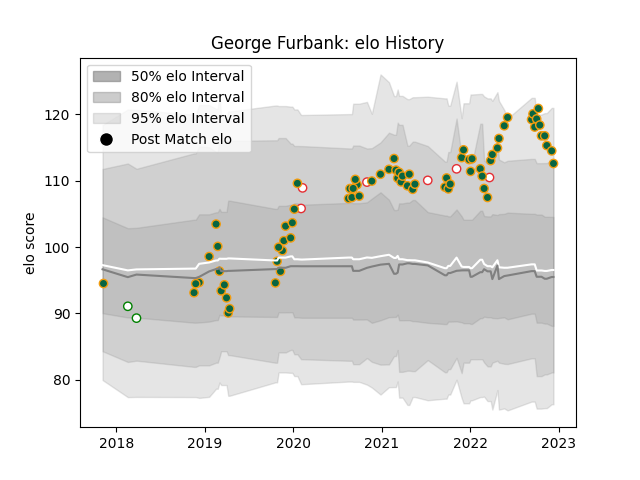

---  
layout: page  
title: George Furbank  
date: 2023-02-02 18:53:09.892929  
categories: player  
---
# George Furbank

## Positions: FB, FH

## Country: England

## Current elo: 94.0

## Current Percentile: 45.0

# Elo History

# Match History

| Team               |   Appearances |   Win Rate |
|:-------------------|--------------:|-----------:|
| Northampton Saints |            80 |   0.525    |
| England            |             6 |   0.666667 |
| Nottingham         |             3 |   0.333333 |

| Opponent            |   Matches |   Win Rate |
|:--------------------|----------:|-----------:|
| Harlequins          |         8 |   0.5      |
| Sale Sharks         |         8 |   0.25     |
| Exeter Chiefs       |         8 |   0.375    |
| Leicester Tigers    |         7 |   0.571429 |
| Bath Rugby          |         6 |   0.5      |
| Wasps               |         6 |   0.666667 |
| Gloucester Rugby    |         6 |   0.5      |
| Saracens            |         5 |   0.2      |
| London Irish        |         5 |   1        |
| Bristol Rugby       |         4 |   0.5      |
| Newcastle Falcons   |         4 |   0.75     |
| Worcester Warriors  |         3 |   1        |
| La Rochelle         |         2 |   0        |
| France              |         2 |   0        |
| Lyon                |         2 |   1        |
| Munster             |         2 |   0        |
| Hartpury College    |         1 |   0        |
| Benetton Treviso    |         1 |   1        |
| Ealing Trailfinders |         1 |   0        |
| Dragons             |         1 |   1        |
| Cornish Pirates     |         1 |   1        |
| Clermont Auvergne   |         1 |   0        |
| Scotland            |         1 |   1        |
| Timisoara Saracens  |         1 |   1        |
| Tonga               |         1 |   1        |
| Canada              |         1 |   1        |
| Italy               |         1 |   1        |