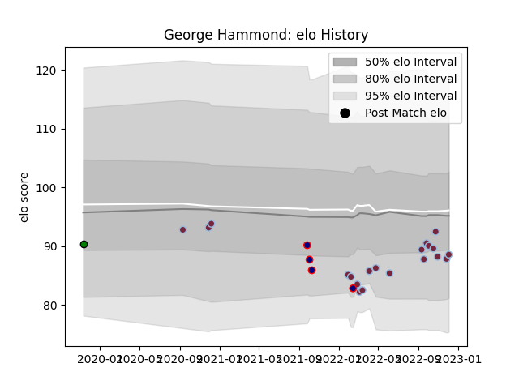

---  
layout: page  
title: George Hammond  
date: 2022-12-09 13:17:49.005318  
categories: player  
---
# George Hammond

## Positions: L

## Current elo: 89.0

## Current Percentile: 22.0

# Elo History

# Match History

| Team               |   Appearances |   Win Rate |
|:-------------------|--------------:|-----------:|
| Harlequins         |            20 |        0.7 |
| London Scottish    |             4 |        0   |
| Yorkshire Carnegie |             1 |        0   |

| Opponent            |   Matches |   Win Rate |
|:--------------------|----------:|-----------:|
| London Irish        |         3 |        1   |
| Bath Rugby          |         2 |        0.5 |
| Exeter Chiefs       |         2 |        0   |
| Gloucester Rugby    |         2 |        1   |
| Leicester Tigers    |         2 |        0.5 |
| Newcastle Falcons   |         2 |        1   |
| Northampton Saints  |         2 |        1   |
| Sale Sharks         |         2 |        0.5 |
| Ampthill            |         1 |        0   |
| Bristol Rugby       |         1 |        1   |
| Cornish Pirates     |         1 |        0   |
| Doncaster           |         1 |        0   |
| Ealing Trailfinders |         1 |        0   |
| Richmond            |         1 |        0   |
| Saracens            |         1 |        0   |
| Worcester Warriors  |         1 |        1   |