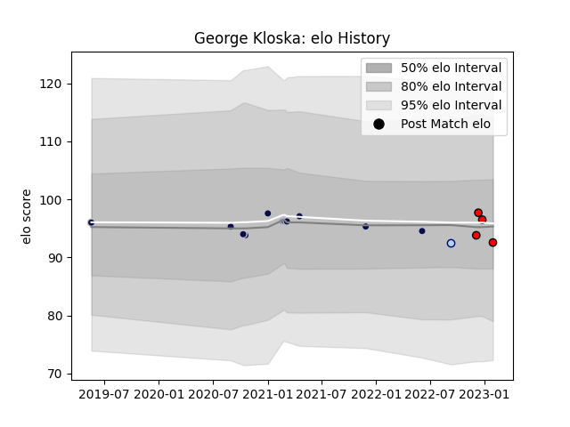

---  
layout: page  
title: George Kloska  
date: 2023-02-02 18:54:06.328212  
categories: player  
---
# George Kloska

## Positions: H, P

## Current elo: 93.0

## Current Percentile: None

# Elo History

# Match History

| Team             |   Appearances |   Win Rate |
|:-----------------|--------------:|-----------:|
| Bristol Rugby    |            11 |   0.590909 |
| Hartpury College |             4 |   1        |
| Bedford          |             1 |   0        |

| Opponent           |   Matches |   Win Rate |
|:-------------------|----------:|-----------:|
| Newcastle Falcons  |         3 |        1   |
| Coventry           |         2 |        0.5 |
| Sale Sharks        |         2 |        0   |
| Ampthill           |         1 |        1   |
| Cornish Pirates    |         1 |        1   |
| Leicester Tigers   |         1 |        1   |
| London Irish       |         1 |        0.5 |
| Northampton Saints |         1 |        0   |
| Richmond           |         1 |        1   |
| Toulon             |         1 |        1   |
| Wasps              |         1 |        0   |
| Worcester Warriors |         1 |        1   |