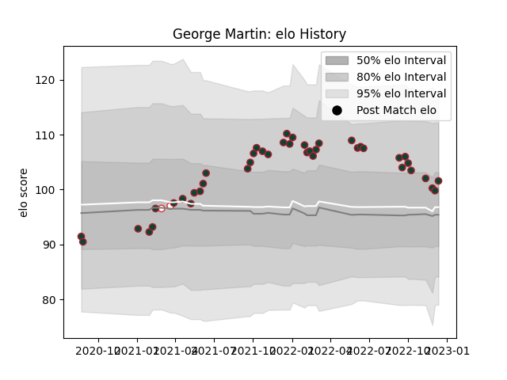

---  
layout: page  
title: George Martin  
date: 2022-11-16 11:35:00.682067  
categories: player  
---
# George Martin

## Positions: FL

## Country: England

## Current elo: 102.0

## Current Percentile: 74.0

# Elo History

# Match History

| Team             |   Appearances |   Win Rate |
|:-----------------|--------------:|-----------:|
| Leicester Tigers |            39 |   0.692308 |
| England          |             2 |   0        |

| Opponent           |   Matches |   Win Rate |
|:-------------------|----------:|-----------:|
| Bath Rugby         |         6 |        0.5 |
| Sale Sharks        |         5 |        0.2 |
| Newcastle Falcons  |         4 |        1   |
| Saracens           |         4 |        0.5 |
| Northampton Saints |         3 |        1   |
| Worcester Warriors |         3 |        1   |
| Bristol Rugby      |         2 |        0.5 |
| Exeter Chiefs      |         2 |        0.5 |
| Gloucester Rugby   |         2 |        1   |
| Harlequins         |         2 |        0.5 |
| London Irish       |         2 |        1   |
| Wasps              |         2 |        1   |
| Bordeaux Begles    |         1 |        1   |
| Connacht           |         1 |        1   |
| Ireland            |         1 |        0   |
| Wales              |         1 |        0   |