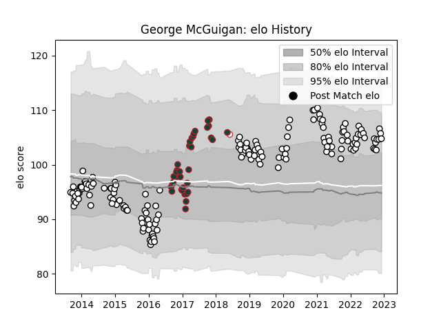

---  
layout: page  
title: George McGuigan  
date: 2022-11-15 23:42:57.536964  
categories: player  
---
# George McGuigan

## Positions: H

## Country: England

## Current elo: 105.0

## Current Percentile: 80.0

# Elo History

# Match History

| Team              |   Appearances |   Win Rate |
|:------------------|--------------:|-----------:|
| Newcastle Falcons |           155 |   0.345161 |
| Leicester Tigers  |            35 |   0.628571 |
| England           |             1 |   0        |

| Opponent             |   Matches |   Win Rate |
|:---------------------|----------:|-----------:|
| Gloucester Rugby     |        17 |  0.352941  |
| Bath Rugby           |        15 |  0.4       |
| Saracens             |        15 |  0.0666667 |
| Exeter Chiefs        |        14 |  0.214286  |
| Wasps                |        14 |  0.25      |
| Northampton Saints   |        14 |  0.428571  |
| Harlequins           |        13 |  0.307692  |
| Sale Sharks          |        12 |  0.375     |
| Worcester Warriors   |        12 |  0.541667  |
| London Irish         |        10 |  0.5       |
| Leicester Tigers     |         9 |  0.111111  |
| Bristol Rugby        |         7 |  0.428571  |
| Brive                |         4 |  0.25      |
| Bedford              |         2 |  1         |
| Toulon               |         2 |  0.5       |
| Stade Francais Paris |         2 |  0.5       |
| Dragons              |         2 |  0.5       |
| Edinburgh            |         2 |  0         |
| Calvisano            |         2 |  1         |
| Racing 92            |         2 |  0.5       |
| RC Enisei            |         2 |  0.5       |
| Bucuresti            |         2 |  1         |
| Newcastle Falcons    |         2 |  1         |
| Munster              |         1 |  0         |
| Nottingham           |         1 |  1         |
| Castres Olympique    |         1 |  1         |
| Montpellier Herault  |         1 |  1         |
| London Welsh         |         1 |  1         |
| Connacht             |         1 |  1         |
| Jersey               |         1 |  1         |
| Hartpury College     |         1 |  1         |
| Barbarians           |         1 |  0         |
| Cardiff Blues        |         1 |  0         |
| Ealing Trailfinders  |         1 |  1         |
| Doncaster            |         1 |  1         |
| Coventry             |         1 |  1         |
| Cornish Pirates      |         1 |  1         |
| Ampthill             |         1 |  1         |