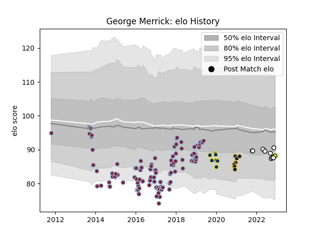

---  
layout: page  
title: George Merrick  
date: 2023-03-21 18:19:57.235409  
categories: player  
---
# George Merrick

Last updated: 2023-03-21
## Positions: L

## Current elo: 96.0

## Current Percentile: 40.0

# Elo History

# Match History

| Team               |   Appearances |   Win Rate |
|:-------------------|--------------:|-----------:|
| Harlequins         |           109 |   0.481651 |
| Clermont Auvergne  |            11 |   0.545455 |
| Newcastle Falcons  |             9 |   0.222222 |
| Worcester Warriors |             7 |   0.142857 |
| Carcassonne        |             3 |   0.333333 |

| Opponent             |   Matches |   Win Rate |
|:---------------------|----------:|-----------:|
| Gloucester Rugby     |        12 |   0.458333 |
| Sale Sharks          |         9 |   0.333333 |
| Northampton Saints   |         9 |   0.222222 |
| Wasps                |         9 |   0.666667 |
| Exeter Chiefs        |         9 |   0.111111 |
| Newcastle Falcons    |         9 |   0.555556 |
| Saracens             |         9 |   0.444444 |
| Bath Rugby           |         8 |   0.5      |
| Worcester Warriors   |         8 |   0.5      |
| London Irish         |         7 |   0.571429 |
| Bristol Rugby        |         5 |   0.8      |
| Leicester Tigers     |         5 |   0.4      |
| Stade Francais Paris |         4 |   0.75     |
| La Rochelle          |         3 |   0.333333 |
| Pau                  |         2 |   0        |
| Timisoara Saracens   |         2 |   1        |
| Ulster               |         2 |   0        |
| Agen                 |         2 |   1        |
| Benetton Treviso     |         2 |   0.5      |
| Calvisano            |         2 |   1        |
| Cardiff Blues        |         2 |   0.5      |
| Harlequins           |         1 |   0        |
| Grenoble             |         1 |   0        |
| Bayonne              |         1 |   1        |
| Toulon               |         1 |   0        |
| Bordeaux Begles      |         1 |   0        |
| Brive                |         1 |   0        |
| Scarlets             |         1 |   0        |
| Racing 92            |         1 |   0        |
| Provence Rugby       |         1 |   0        |
| Castres Olympique    |         1 |   1        |
| Ospreys              |         1 |   0        |
| Clermont Auvergne    |         1 |   0        |
| Dragons              |         1 |   1        |
| Nevers               |         1 |   1        |
| Montpellier Herault  |         1 |   0        |
| Mont-de-Marsan       |         1 |   0        |
| Lyon                 |         1 |   1        |
| Edinburgh            |         1 |   0        |
| London Welsh         |         1 |   1        |