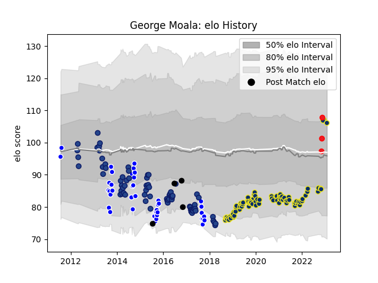

---  
layout: page  
title: George Moala  
date: 2022-11-22 11:37:15.469360  
categories: player  
---
# George Moala

## Positions: C, W

## Country: Tonga

## Current elo: 115.0

## Current Percentile: 89.0

# Elo History

# Match History

| Team              |   Appearances |   Win Rate |
|:------------------|--------------:|-----------:|
| Clermont Auvergne |            80 |   0.60625  |
| Blues             |            73 |   0.383562 |
| Auckland          |            41 |   0.560976 |
| New Zealand       |             4 |   0.75     |
| Tonga             |             3 |   1        |

| Opponent                 |   Matches |   Win Rate |
|:-------------------------|----------:|-----------:|
| Highlanders              |        10 |  0.3       |
| Crusaders                |         9 |  0.222222  |
| Bordeaux Begles          |         9 |  0.222222  |
| Chiefs                   |         9 |  0.0555556 |
| Hurricanes               |         8 |  0.25      |
| Toulon                   |         7 |  0.428571  |
| Castres Olympique        |         7 |  0.571429  |
| Lyon                     |         6 |  0.5       |
| Canterbury               |         6 |  0.166667  |
| Stade Francais Paris     |         5 |  1         |
| La Rochelle              |         5 |  0.8       |
| Montpellier Herault      |         5 |  0.4       |
| Racing 92                |         4 |  0.25      |
| Sharks                   |         4 |  0.25      |
| Pau                      |         4 |  0.75      |
| Stade Toulousain         |         4 |  0.5       |
| North Harbour            |         4 |  0.75      |
| New South Wales Waratahs |         4 |  0.5       |
| Tasman                   |         4 |  0.625     |
| Melbourne Rebels         |         4 |  0.75      |
| Waikato                  |         4 |  0.5       |
| Western Force            |         4 |  1         |
| Brumbies                 |         4 |  0.5       |
| Counties Manukau         |         4 |  0.5       |
| Wellington               |         3 |  0.666667  |
| Bayonne                  |         3 |  0.666667  |
| Manawatu                 |         3 |  1         |
| Brive                    |         3 |  0.666667  |
| Northland                |         3 |  1         |
| Otago                    |         3 |  0.333333  |
| Cheetahs                 |         3 |  0.666667  |
| Perpignan                |         3 |  0.666667  |
| Queensland Reds          |         3 |  0.5       |
| Bulls                    |         3 |  0.666667  |
| Bay of Plenty            |         2 |  1         |
| Ulster                   |         2 |  0.5       |
| Timisoara Saracens       |         2 |  1         |
| Taranaki                 |         2 |  0         |
| Southland                |         2 |  0.75      |
| Stormers                 |         2 |  0         |
| Agen                     |         2 |  1         |
| Bath Rugby               |         2 |  1         |
| Harlequins               |         2 |  1         |
| Lions                    |         2 |  0         |
| Grenoble                 |         2 |  0.75      |
| Biarritz Olympique       |         1 |  1         |
| Jaguares                 |         1 |  1         |
| Wales                    |         1 |  1         |
| Uruguay                  |         1 |  1         |
| Dragons                  |         1 |  1         |
| Ireland                  |         1 |  0         |
| South Africa             |         1 |  1         |
| Sunwolves                |         1 |  0         |
| Chile                    |         1 |  1         |
| British and Irish Lions  |         1 |  1         |
| Northampton Saints       |         1 |  1         |
| Spain                    |         1 |  1         |
| Samoa                    |         1 |  1         |
| Southern Kings           |         1 |  1         |
| Hawke's Bay              |         1 |  0         |