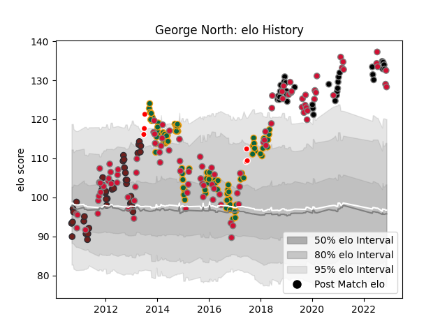

---  
layout: page  
title: George North  
date: 2022-11-15 23:44:24.748737  
categories: player  
---
# George North

## Positions: W

## Country: Wales

## Current elo: 128.0

## Current Percentile: 96.0

# Elo History

# Match History

| Team                    |   Appearances |   Win Rate |
|:------------------------|--------------:|-----------:|
| Wales                   |           101 |   0.564356 |
| Northampton Saints      |            87 |   0.632184 |
| Scarlets                |            42 |   0.595238 |
| Ospreys                 |            32 |   0.640625 |
| British and Irish Lions |             6 |   0.75     |

| Opponent             |   Matches |   Win Rate |
|:---------------------|----------:|-----------:|
| Australia            |        14 |   0.285714 |
| France               |        14 |   0.571429 |
| Ireland              |        13 |   0.576923 |
| South Africa         |        13 |   0.307692 |
| England              |        13 |   0.461538 |
| Dragons              |        10 |   0.65     |
| Italy                |        10 |   1        |
| Harlequins           |        10 |   0.8      |
| Leicester Tigers     |         9 |   0.5      |
| Ospreys              |         9 |   0.611111 |
| Saracens             |         8 |   0.125    |
| Wasps                |         8 |   0.375    |
| Glasgow Warriors     |         7 |   1        |
| Scotland             |         7 |   0.857143 |
| Scarlets             |         7 |   0.642857 |
| Castres Olympique    |         7 |   0.714286 |
| Cardiff Blues        |         7 |   1        |
| Bath Rugby           |         7 |   0.857143 |
| Gloucester Rugby     |         7 |   0.714286 |
| Argentina            |         6 |   0.833333 |
| Benetton Treviso     |         6 |   0.666667 |
| Leinster             |         5 |   0.4      |
| London Irish         |         5 |   0.8      |
| Fiji                 |         5 |   0.9      |
| Exeter Chiefs        |         4 |   0.75     |
| Edinburgh            |         4 |   0.75     |
| Sale Sharks          |         4 |   0.5      |
| Racing 92            |         4 |   0.125    |
| New Zealand          |         4 |   0        |
| Newcastle Falcons    |         3 |   0.666667 |
| Connacht             |         3 |   1        |
| Munster              |         3 |   0.166667 |
| Worcester Warriors   |         3 |   0.666667 |
| Samoa                |         2 |   0.5      |
| Ulster               |         2 |   0        |
| Northampton Saints   |         2 |   0.5      |
| Zebre                |         2 |   1        |
| Montpellier Herault  |         2 |   0.5      |
| Bristol Rugby        |         2 |   1        |
| Clermont Auvergne    |         2 |   0        |
| New Zealand Maori    |         1 |   1        |
| Stade Francais Paris |         1 |   1        |
| Yorkshire Carnegie   |         1 |   1        |
| Brive                |         1 |   0        |
| Bulls                |         1 |   0        |
| Tonga                |         1 |   1        |
| Stormers             |         1 |   0.5      |
| Cheetahs             |         1 |   1        |
| Namibia              |         1 |   1        |
| Crusaders            |         1 |   1        |
| Georgia              |         1 |   1        |
| Hurricanes           |         1 |   0.5      |
| Lions                |         1 |   0        |
| Pau                  |         1 |   1        |
| Aironi               |         1 |   1        |