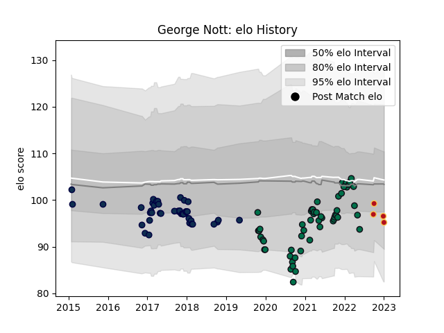

---  
layout: page  
title: George Nott  
date: 2023-02-02 19:00:58.542614  
categories: player  
---
# George Nott

## Positions: L

## Current elo: 79.0

## Current Percentile: 15.0

# Elo History

# Match History

| Team         |   Appearances |   Win Rate |
|:-------------|--------------:|-----------:|
| London Irish |            54 |   0.324074 |
| Sale Sharks  |            43 |   0.488372 |
| Dragons      |             8 |   0.25     |

| Opponent           |   Matches |   Win Rate |
|:-------------------|----------:|-----------:|
| Worcester Warriors |        10 |   0.6      |
| Saracens           |         8 |   0.3125   |
| Leicester Tigers   |         7 |   0.285714 |
| Wasps              |         7 |   0.642857 |
| Northampton Saints |         7 |   0.142857 |
| Bath Rugby         |         7 |   0.428571 |
| Bristol Rugby      |         6 |   0.333333 |
| Exeter Chiefs      |         6 |   0.333333 |
| Gloucester Rugby   |         5 |   0.1      |
| Harlequins         |         5 |   0.4      |
| Newcastle Falcons  |         5 |   0.4      |
| Cardiff Blues      |         4 |   0.5      |
| Sale Sharks        |         4 |   0.125    |
| Toulon             |         3 |   0        |
| Pau                |         3 |   1        |
| Scarlets           |         3 |   0.333333 |
| Lyon               |         2 |   0.5      |
| Stade Toulousain   |         2 |   0.25     |
| Munster            |         2 |   0.5      |
| Bulls              |         1 |   0        |
| Sharks             |         1 |   0        |
| Edinburgh          |         1 |   1        |
| Perpignan          |         1 |   1        |
| London Irish       |         1 |   1        |
| Lions              |         1 |   0        |
| Dragons            |         1 |   0        |
| Glasgow Warriors   |         1 |   0        |
| Connacht           |         1 |   1        |