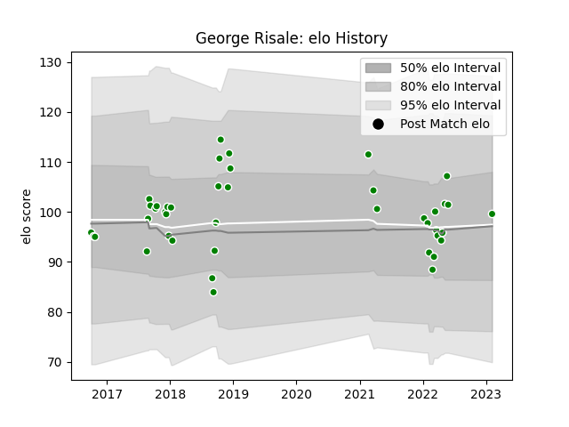

---  
layout: page  
title: George Risale  
date: 2023-02-09 13:57:25.254371  
categories: player  
---
# George Risale

## Positions: N8

## Current elo: 100.0

## Current Percentile: 60.0

# Elo History

# Match History

| Team                  |   Appearances |   Win Rate |
|:----------------------|--------------:|-----------:|
| Green Rockets Tokatsu |            42 |    0.27381 |

| Opponent                          |   Matches |   Win Rate |
|:----------------------------------|----------:|-----------:|
| Kobelco Kobe Steelers             |         4 |   0        |
| Kubota Spears Funabashi Tokyo-Bay |         4 |   0.375    |
| Toshiba Brave Lupus Tokyo         |         4 |   0.25     |
| Yokohama Canon Eagles             |         4 |   0.25     |
| Mie Honda Heat                    |         3 |   0.333333 |
| Tokyo Sungoliath                  |         3 |   0        |
| Toyota Verblitz                   |         3 |   0.333333 |
| Black Rams Tokyo                  |         2 |   0        |
| Coca-Cola Red Sparks              |         2 |   1        |
| Hino Red Dolphins                 |         2 |   0.5      |
| NTT Docomo Red Hurricanes Osaka   |         2 |   0        |
| Saitama Wild Knights              |         2 |   0        |
| Shizuoka Blue Revs                |         2 |   0        |
| Toyota Industries Shuttles Aichi  |         2 |   0.5      |
| Urayasu D-Rocks                   |         2 |   0.5      |
| Munakata Sanix Blues              |         1 |   1        |