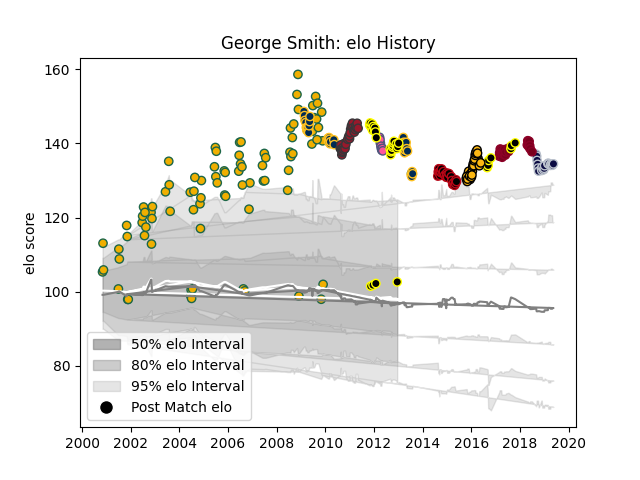

---  
layout: page  
title: George Smith  
date: 2023-03-21 18:56:39.882053  
categories: player  
---
# George Smith

Last updated: 2023-03-21
## Positions: FL, N8

## Country: Australia

## Current elo: 104.0

## Current Percentile: 97.0

# Elo History

# Match History

| Team                 |   Appearances |   Win Rate |
|:---------------------|--------------:|-----------:|
| Brumbies             |           109 |   0.600917 |
| Australia            |            98 |   0.612245 |
| Tokyo Sungoliath     |            50 |   0.94     |
| Toulon               |            30 |   0.6      |
| Wasps                |            26 |   0.615385 |
| Lyon                 |            25 |   0.34     |
| Bristol Rugby        |            22 |   0.477273 |
| Queensland Reds      |            22 |   0.227273 |
| Stade Francais Paris |             8 |   0.375    |

| Opponent                          |   Matches |   Win Rate |
|:----------------------------------|----------:|-----------:|
| New Zealand                       |        20 |   0.25     |
| South Africa                      |        18 |   0.555556 |
| England                           |        12 |   0.5      |
| Highlanders                       |        11 |   0.545455 |
| Blues                             |        11 |   0.272727 |
| Crusaders                         |        11 |   0.363636 |
| Chiefs                            |        10 |   0.5      |
| France                            |        10 |   0.7      |
| Sharks                            |        10 |   0.7      |
| Bulls                             |        10 |   0.6      |
| Western Force                     |         9 |   0.444444 |
| Hurricanes                        |         9 |   0.333333 |
| Stormers                          |         9 |   0.722222 |
| Queensland Reds                   |         8 |   0.9375   |
| New South Wales Waratahs          |         8 |   0.375    |
| Scotland                          |         8 |   0.875    |
| Exeter Chiefs                     |         7 |   0.285714 |
| Wales                             |         6 |   0.666667 |
| Bath Rugby                        |         6 |   0.666667 |
| Lions                             |         6 |   0.666667 |
| Ireland                           |         6 |   0.833333 |
| Cheetahs                          |         5 |   0.8      |
| Italy                             |         5 |   1        |
| Toulon                            |         5 |   0.2      |
| La Rochelle                       |         5 |   0.5      |
| Saitama Wild Knights              |         5 |   0.8      |
| Racing 92                         |         5 |   0        |
| Clermont Auvergne                 |         5 |   0.4      |
| Leicester Tigers                  |         4 |   0.75     |
| Toyota Verblitz                   |         4 |   1        |
| Newcastle Falcons                 |         4 |   1        |
| Urayasu D-Rocks                   |         4 |   1        |
| Montpellier Herault               |         4 |   0.5      |
| Perpignan                         |         4 |   0.75     |
| Northampton Saints                |         4 |   0.75     |
| Green Rockets Tokatsu             |         4 |   0.75     |
| Kobelco Kobe Steelers             |         4 |   1        |
| Harlequins                        |         4 |   0.5      |
| Gloucester Rugby                  |         4 |   0.5      |
| Saracens                          |         4 |   0.5      |
| Cats                              |         4 |   0.75     |
| Castres Olympique                 |         4 |   0.5      |
| Brive                             |         4 |   0.5      |
| British and Irish Lions           |         4 |   0.5      |
| Black Rams Tokyo                  |         4 |   1        |
| Stade Francais Paris              |         4 |   0.5      |
| Bayonne                           |         4 |   0.25     |
| Sale Sharks                       |         3 |   0.166667 |
| Toshiba Brave Lupus Tokyo         |         3 |   0.666667 |
| Shizuoka Blue Revs                |         3 |   1        |
| Agen                              |         3 |   0.666667 |
| Warathas                          |         3 |   0.333333 |
| NTT Docomo Red Hurricanes Osaka   |         3 |   1        |
| Biarritz Olympique                |         3 |   0.666667 |
| Hanazono Kintetsu Liners          |         3 |   1        |
| Stade Toulousain                  |         3 |   0.333333 |
| Munakata Sanix Blues              |         3 |   1        |
| Toyota Industries Shuttles Aichi  |         2 |   1        |
| Southern Kings                    |         2 |   0.75     |
| Bordeaux Begles                   |         2 |   0        |
| Bourgoin-Jallieu                  |         2 |   1        |
| Brumbies                          |         2 |   0.5      |
| Yokohama Canon Eagles             |         2 |   1        |
| Oyonnax                           |         2 |   0.5      |
| Grenoble                          |         2 |   0.5      |
| Munster                           |         2 |   0.5      |
| Kyuden Voltex                     |         2 |   1        |
| Leinster                          |         2 |   1        |
| Argentina                         |         2 |   1        |
| Mie Honda Heat                    |         2 |   1        |
| Worcester Warriors                |         2 |   0.5      |
| Wasps                             |         1 |   0        |
| Sunwolves                         |         1 |   0        |
| Melbourne Rebels                  |         1 |   1        |
| Spain                             |         1 |   1        |
| Samoa                             |         1 |   1        |
| Romania                           |         1 |   1        |
| Pacific Islands                   |         1 |   1        |
| Ospreys                           |         1 |   1        |
| Namibia                           |         1 |   1        |
| London Irish                      |         1 |   1        |
| Kubota Spears Funabashi Tokyo-Bay |         1 |   1        |
| Japan                             |         1 |   1        |
| Jaguares                          |         1 |   0        |
| Coca-Cola Red Sparks              |         1 |   1        |
| Canada                            |         1 |   1        |
| Zebre                             |         1 |   1        |