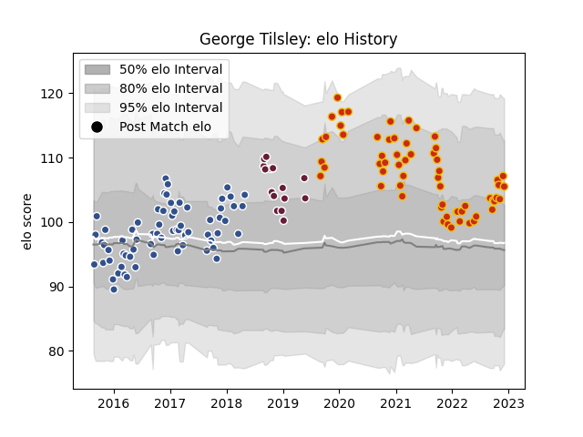

---  
layout: page  
title: George Tilsley  
date: 2022-12-09 13:15:19.990744  
categories: player  
---
# George Tilsley

## Positions: W, C

## Current elo: 106.0

## Current Percentile: 82.0

# Elo History

# Match History

| Team            |   Appearances |   Win Rate |
|:----------------|--------------:|-----------:|
| Agen            |            66 |   0.416667 |
| Perpignan       |            61 |   0.540984 |
| Bordeaux Begles |            15 |   0.466667 |

| Opponent             |   Matches |   Win Rate |
|:---------------------|----------:|-----------:|
| Castres Olympique    |         8 |   0.375    |
| Pau                  |         8 |   0.25     |
| La Rochelle          |         7 |   0.285714 |
| Toulon               |         7 |   0.571429 |
| Stade Toulousain     |         7 |   0.142857 |
| Bordeaux Begles      |         7 |   0.285714 |
| Racing 92            |         7 |   0.571429 |
| Lyon                 |         6 |   0.333333 |
| Clermont Auvergne    |         6 |   0.333333 |
| Stade Francais Paris |         5 |   0.4      |
| Biarritz Olympique   |         5 |   0.6      |
| Soyaux-Angouleme     |         5 |   1        |
| Oyonnax              |         5 |   0.4      |
| Montpellier Herault  |         5 |   0.1      |
| Montauban            |         5 |   0.8      |
| Perpignan            |         4 |   0.625    |
| Vannes               |         4 |   0.875    |
| Grenoble             |         4 |   0.5      |
| Colomiers            |         4 |   0.5      |
| Carcassonne          |         4 |   0.75     |
| Brive                |         4 |   0.5      |
| Aurillac             |         4 |   0.75     |
| Mont-de-Marsan       |         3 |   0.666667 |
| Provence Rugby       |         3 |   0.666667 |
| Rouen                |         3 |   0.666667 |
| Dax                  |         2 |   1        |
| Narbonne             |         2 |   0.5      |
| Bourgoin-Jallieu     |         2 |   1        |
| Beziers              |         2 |   0        |
| Albi                 |         1 |   0        |
| Connacht             |         1 |   0        |
| Bayonne              |         1 |   0        |
| Agen                 |         1 |   0        |