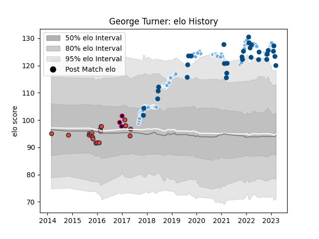

---  
layout: page  
title: George Turner  
date: 2022-12-18 16:39:46.449828  
categories: player  
---
# George Turner

## Positions: H

## Country: Scotland

## Current elo: 122.0

## Current Percentile: 98.0

# Elo History

# Match History

| Team             |   Appearances |   Win Rate |
|:-----------------|--------------:|-----------:|
| Glasgow Warriors |            72 |   0.590278 |
| Scotland         |            27 |   0.62963  |
| Edinburgh        |            20 |   0.4      |
| London Scottish  |             2 |   0.5      |

| Opponent                 |   Matches |   Win Rate |
|:-------------------------|----------:|-----------:|
| Leinster                 |        11 |   0.181818 |
| Edinburgh                |         8 |   0.375    |
| Ospreys                  |         8 |   0.625    |
| Cardiff Blues            |         8 |   0.75     |
| Scarlets                 |         7 |   0.428571 |
| Zebre                    |         6 |   0.833333 |
| Connacht                 |         5 |   0.4      |
| France                   |         4 |   0.5      |
| Exeter Chiefs            |         4 |   0.375    |
| Argentina                |         4 |   0.75     |
| Benetton Treviso         |         4 |   0.5      |
| Dragons                  |         3 |   1        |
| Ulster                   |         3 |   0.333333 |
| Southern Kings           |         3 |   0.666667 |
| La Rochelle              |         2 |   0.5      |
| Sharks                   |         2 |   0.5      |
| England                  |         2 |   1        |
| Munster                  |         2 |   1        |
| Lyon                     |         2 |   1        |
| Australia                |         2 |   0.5      |
| Bulls                    |         2 |   0.5      |
| Italy                    |         2 |   1        |
| Ireland                  |         2 |   0        |
| Glasgow Warriors         |         2 |   1        |
| Wales                    |         2 |   0        |
| Cheetahs                 |         2 |   1        |
| Sale Sharks              |         2 |   1        |
| Samoa                    |         1 |   1        |
| Tonga                    |         1 |   1        |
| Stormers                 |         1 |   0        |
| United States of America |         1 |   0        |
| Bath Rugby               |         1 |   1        |
| Saracens                 |         1 |   0        |
| New Zealand              |         1 |   0        |
| Russia                   |         1 |   1        |
| Rotherham Titans         |         1 |   1        |
| Perpignan                |         1 |   1        |
| Montpellier Herault      |         1 |   0        |
| London Welsh             |         1 |   0        |
| Japan                    |         1 |   1        |
| Georgia                  |         1 |   1        |
| Canada                   |         1 |   1        |
| Fiji                     |         1 |   1        |
| London Irish             |         1 |   0        |