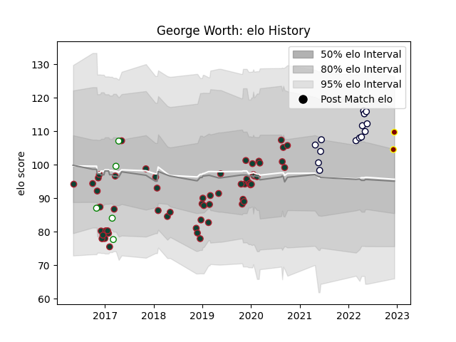

---  
layout: page  
title: George Worth  
date: 2022-12-18 16:38:35.811789  
categories: player  
---
# George Worth

## Positions: FB, C

## Current elo: 85.0

## Current Percentile: 11.0

# Elo History

# Match History

| Team             |   Appearances |   Win Rate |
|:-----------------|--------------:|-----------:|
| Leicester Tigers |            58 |   0.422414 |
| Melbourne Rebels |            14 |   0.285714 |
| Nottingham       |             4 |   0.5      |
| Ampthill         |             2 |   0.25     |

| Opponent                 |   Matches |   Win Rate |
|:-------------------------|----------:|-----------:|
| Saracens                 |         7 |   0.142857 |
| Bath Rugby               |         6 |   0.166667 |
| Wasps                    |         5 |   0.4      |
| Gloucester Rugby         |         5 |   0.6      |
| Exeter Chiefs            |         4 |   0.25     |
| Northampton Saints       |         4 |   0.5      |
| Harlequins               |         4 |   0.625    |
| Worcester Warriors       |         4 |   0.5      |
| Bristol Rugby            |         3 |   0.666667 |
| Richmond                 |         3 |   0.5      |
| Cardiff Blues            |         3 |   1        |
| Crusaders                |         2 |   0        |
| Pau                      |         2 |   0.5      |
| Western Force            |         2 |   0.5      |
| Sale Sharks              |         2 |   0.5      |
| Munster                  |         2 |   0.5      |
| Hurricanes               |         2 |   0        |
| Chiefs                   |         2 |   0        |
| Bedford                  |         1 |   0        |
| Blues                    |         1 |   0        |
| Scarlets                 |         1 |   0        |
| Fijian Drua              |         1 |   1        |
| Glasgow Warriors         |         1 |   0        |
| Castres Olympique        |         1 |   0        |
| Racing 92                |         1 |   0        |
| Highlanders              |         1 |   0        |
| Hartpury College         |         1 |   0        |
| Calvisano                |         1 |   1        |
| New South Wales Waratahs |         1 |   1        |
| Dragons                  |         1 |   1        |
| Moana Pasifika           |         1 |   1        |
| London Scottish          |         1 |   1        |
| London Irish             |         1 |   0        |
| Queensland Reds          |         1 |   0        |