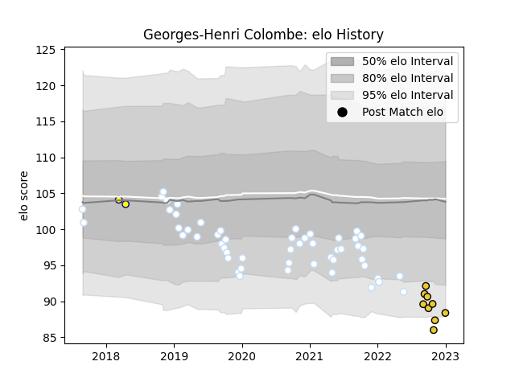

---  
layout: page  
title: Georges-Henri Colombe  
date: 2023-01-06 00:19:35.917547  
categories: player  
---
# Georges-Henri Colombe

## Positions: P

## Current elo: 88.0

## Current Percentile: 4.0

# Elo History

# Match History

| Team        |   Appearances |   Win Rate |
|:------------|--------------:|-----------:|
| Racing 92   |            52 |   0.567308 |
| La Rochelle |             9 |   0.666667 |
| Nevers      |             2 |   0.5      |

| Opponent             |   Matches |   Win Rate |
|:---------------------|----------:|-----------:|
| Clermont Auvergne    |         7 |   0.714286 |
| Montpellier Herault  |         6 |   0.666667 |
| Lyon                 |         5 |   0.4      |
| Pau                  |         5 |   0.8      |
| Stade Toulousain     |         4 |   0        |
| Agen                 |         4 |   0.625    |
| Toulon               |         3 |   0.333333 |
| La Rochelle          |         3 |   0.333333 |
| Bordeaux Begles      |         3 |   0.333333 |
| Stade Francais Paris |         3 |   0.333333 |
| Brive                |         3 |   1        |
| Perpignan            |         3 |   1        |
| Grenoble             |         2 |   1        |
| Bayonne              |         2 |   0.5      |
| Castres Olympique    |         1 |   1        |
| Saracens             |         1 |   1        |
| Beziers              |         1 |   0        |
| Scarlets             |         1 |   1        |
| Biarritz Olympique   |         1 |   0        |
| Racing 92            |         1 |   1        |
| Ospreys              |         1 |   1        |
| Leicester Tigers     |         1 |   1        |
| Exeter Chiefs        |         1 |   0        |
| Ulster               |         1 |   0        |