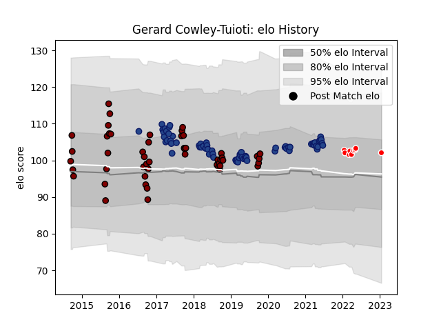

---  
layout: page  
title: Gerard Cowley-Tuioti  
date: 2023-03-21 18:20:15.808796  
categories: player  
---
# Gerard Cowley-Tuioti

Last updated: 2023-03-21
## Positions: L

## Country: Blues

## Current elo: 103.0

## Current Percentile: 66.0

# Elo History

# Match History

| Team                  |   Appearances |   Win Rate |
|:----------------------|--------------:|-----------:|
| Blues                 |            66 |   0.530303 |
| North Harbour         |            51 |   0.558824 |
| Kobelco Kobe Steelers |             8 |   0.5      |

| Opponent                          |   Matches |   Win Rate |
|:----------------------------------|----------:|-----------:|
| Highlanders                       |        10 |   0.5      |
| Chiefs                            |        10 |   0.45     |
| Hurricanes                        |         8 |   0.5      |
| Crusaders                         |         7 |   0        |
| Wellington                        |         6 |   0.333333 |
| Canterbury                        |         6 |   0.166667 |
| Otago                             |         5 |   0.4      |
| Northland                         |         5 |   0.8      |
| Tasman                            |         5 |   0.1      |
| Hawke's Bay                       |         4 |   0.75     |
| New South Wales Waratahs          |         4 |   1        |
| Manawatu                          |         4 |   0.75     |
| Queensland Reds                   |         4 |   0.75     |
| Counties Manukau                  |         4 |   1        |
| Brumbies                          |         4 |   0.75     |
| Stormers                          |         3 |   0.333333 |
| Bay of Plenty                     |         3 |   0.666667 |
| Waikato                           |         3 |   0.666667 |
| Melbourne Rebels                  |         3 |   0.666667 |
| Southland                         |         2 |   1        |
| Taranaki                          |         2 |   1        |
| Sunwolves                         |         2 |   0.5      |
| Western Force                     |         2 |   1        |
| Auckland                          |         2 |   0.5      |
| Lions                             |         2 |   1        |
| Jaguares                          |         2 |   0        |
| Bulls                             |         2 |   0.75     |
| Yokohama Canon Eagles             |         2 |   0.5      |
| Sharks                            |         1 |   0        |
| Saitama Wild Knights              |         1 |   0        |
| Kubota Spears Funabashi Tokyo-Bay |         1 |   1        |
| Cheetahs                          |         1 |   1        |
| Tokyo Sungoliath                  |         1 |   0        |
| Toshiba Brave Lupus Tokyo         |         1 |   0        |
| Urayasu D-Rocks                   |         1 |   1        |
| British and Irish Lions           |         1 |   1        |
| Black Rams Tokyo                  |         1 |   1        |